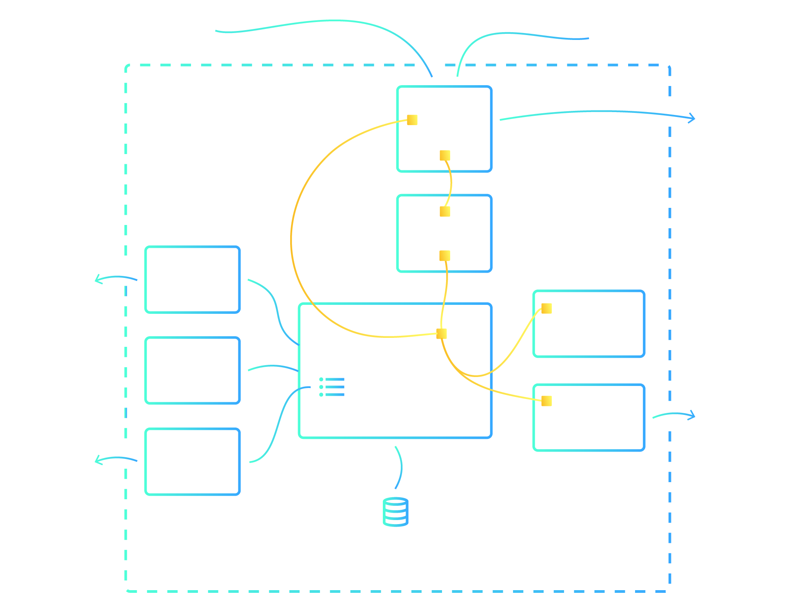

<!-- TODO
show the broad architecture in a diagram:
- operator
- cluster
-> not too much detail
-->

## The Cluster

A StackGres cluster is basically a StatefulSet where each pod is a database instance. The
 StatefulSet guarantees that each pod is always bound to its own persistent volume. Therefore, the
 database instance data will be mapped to the state of a Patroni instance inside kubernetes.

### StackGres Cluster Architecture diagram

<!-- TODO
show the anatomy of a pod
-->

### StackGres Pod Architecture diagram

We use a pattern called sidecar where a main application runs in a container and other containers co-located in the same pod
 are providing side functionalities like connection pooling, export of stats, edge proxying,
 logging dispatcher or database utilities.
 

> **UDS:** [Unix Domain Socket](https://en.wikipedia.org/wiki/Unix_domain_socket)

