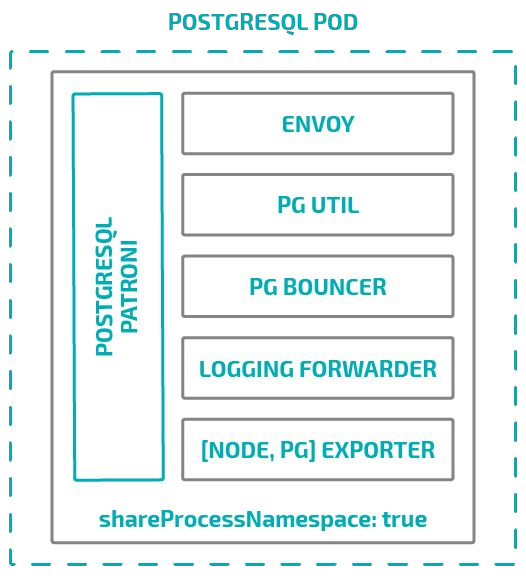

# Architecture

## The Operator

An Operator is a method of packaging, deploying and managing a Kubernetes
application. Some applications, such as databases, required more hand-holding, and a cloud-native
Postgres requires an operator to provide additional knowledge of how to maintain state and integrate
all the components. The StackGres operator allow to deploy a StackGres cluster using a few custom
resources created by the user.

## The Cluster

A StackGres cluster is basically a StatefulSet where each Pod is a database instance. The StatefulSet guarantee
that each Pod is always binded to its own persistent volume so that the database instance data can be mapped to
the state of a patroni instance inside kubernetes.

We use a pattern called sidecar where a main application run in a container and other container are providing a side functionality
like connection pooling, export of stats, edge proxying, logging dispatcher or database utilities.