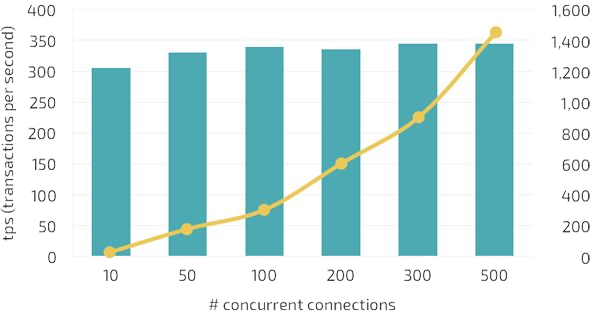

Running Postgres in production requires "a RedHat" of PostgreSQL. A curated set of open source components built,
verified and packaged together. In this sense Postgres is like the Linux kernel, it needs many components around
it to provide what a Linux distribution provide.

Exists an ecosystem of tools built around Postgres that can be used to build a Postgres distribution. This is what
we call the stack of components.

Choosing the right component of this stack is an hard task. Exists many components that overlap functionalities or have
pros and cons to take into account before choosing one over another. It is required an high understanding of all the
components in order to chose the ones that fit together and provide a production ready Postgres distribution.

Our Postgres distribution is composed on a central core component (Postgres) and some other components that fulfill
requirements in each different area required in the Postgres production distribution.

## Core

The main container used for a Postgres cluster node uses an UBI 8 minimal image as its base to which is added a
vanilla PostgreSQL. It uses a persistent storage configured via StorageClass. Is always deployed with a
sidecar util container to allow access for a system/database administrator.

## Configuration

Run PostgreSQL using default configuration is a really bad idea in a production environment. PostgreSQL uses very
conservative defaults so it must be tuned in order to achieve good performance of the database. Exists some places
where you can find information about Postgres configuration parameters and best practices:

* [Postgres Official Documentation](https://www.postgresql.org/docs/)
* [https://postgresqlco.nf](https://postgresqlco.nf) (see [PostgreSQL Configuration for Humans](https://speakerdeck.com/ongres/postgresql-configuration-for-humans))
* [The Internals of PostgreSQL](http://www.interdb.jp/pg/)

StackGres is tuned by default to achieve better performance than using the default configuration. User can still
be configured by user in order to give the flexibility that some users needs.

## Connection pooling

Connecting directly to PostgreSQL does not scale very well.

{}pg_bench, scale 2000, m4.large (2 vCPU, 8GB RAM, 1k IOPS){}

Connection pooling is required in order to not saturate PostgreSQL processes by creating queue of sessions, transactions
or statements (depending on the application requirements).

Exists 3 alternatives solutions:

* [PgPool](https://www.pgpool.net)
* [PgBouncer](https://www.pgbouncer.org/)
* [Odyssey](https://github.com/yandex/odyssey)

Which one to chose?

The StackGres chosen solution is PgBouncer. It is enough simple and stable to be used for connection pooling.
The disadvantage is the lack of multithreading that can lead to CPU saturation when connections increase over certain limit
that depends on the performance of a single CPU's core where it is running. Odyssey will be a good candidate to replace
PgBouncer when it will become more mature.

## High availability

If a Postgres instance goes down or is not working properly we want our cluster to recover by choosing a working instance
to convert to the new primary and configure all the other instances and the application to point to this new primary. We want
all this to happen without manual intervention.

A high availability solution allow to achieve this feature. Exists many solutions to this problem and is really hard to chose
one among them:

* [PgPool](https://www.pgpool.net)
* [Repmgr](https://repmgr.org/)
* [Patroni](https://github.com/zalando/patroni)
* [pg_autofailover](https://github.com/citusdata/pg_auto_failover)
* [PAF](https://dalibo.github.io/PAF/)
* [Stolon](https://github.com/sorintlab/stolon)

Patroni is the HA solution chosen for StackGres. It is a well proved solution that relies on distributed consensus
algorithms in order to provide a consistent mechanism for primary election. In particular it is able to use the same
distributed consensus algorithm used by Kubernetes so that it does not requires installation of other services.

## Backup and disaster recovery

Backup tools solutions are also a very higly populated ecosystem:

* ~~pg_dump~~
* [Barman](https://www.pgbarman.org/)
* [PgBackrest](https://pgbackrest.org/)
* [Wal-e](https://github.com/wal-e/wal-e) / [Wal-g](https://github.com/wal-g/wal-g)
* [pg_probackup](https://github.com/postgrespro/pg_probackup)

Also, where do we store our backups?

* Disk
* Cloud storage

And finally, will our backup work when needed or will it fail?

Wal-g, the successor of Wal-e, is the most complete and lightweight solution to provide both incremental (trough archive
command) and full backup support. Also, it provides out of the box features that allow store backup in a persistent volume
(using a storage class that supports `ReadWriteMany` access mode) or a cloud storage between AWS S3, Google Cloud Storage
or Azure Blob Storage. It also allow configure aspects like bandwidth or disk usage rate.

## Log

We want to store our logs distributed across all our containers in a central location and be able to analyze them when
needed. It does not exists a good solution for that so you have to build one. Exists [fluentd](https://www.fluentd.org/)
and [Loki](https://grafana.com/oss/loki/), this last does not work very well with Postgres. An alternative is to store
all the logs in Postgres using [Timescale](https://github.com/timescale/timescaledb).

## Proxy

How do I locate the primary, if it might be changing? How do I obtain traffic [metrics]({})? It is possible to manage traffic:
duplicate, A/B to test cluster or event inspect it?

[Envoy](https://www.envoyproxy.io/) is an open source edge and service proxy, designed for cloud-native applications. It is
extensible in order to provide advanced functionality based on the actual traffic (for example the Postgres could be parsed
in order to offer stats) or on connection characteristic (like the TLS certificate in order to chose to which node the
connection have to be dispatched.

It is also capable of [exporting metrics]({}) using well established prometheus format.

OnGres Inc. sponsors the Envoy Proxy project, with contributions such as exposing PostgreSQL [monitoring metrics](https://www.envoyproxy.io/docs/envoy/latest/configuration/listeners/network_filters/postgres_proxy_filter#statistics) and implementing the [SSL termination support](https://www.envoyproxy.io/docs/envoy/latest/api-v3/extensions/filters/network/postgres_proxy/v3alpha/postgres_proxy.proto#envoy-v3-api-field-extensions-filters-network-postgres-proxy-v3alpha-postgresproxy-terminate-ssl).

## Monitoring

Which monitoring solution can we use to monitor a Postgres cluster?

* [Zabbix](https://www.zabbix.com/)
* [Okmeter](https://okmeter.io/)
* [Pganalyze](https://pganalyze.com/)
* [Pgwatch2](https://github.com/cybertec-postgresql/pgwatch2)
* [PoWA](https://github.com/powa-team/powa)
* [New Relic](https://newrelic.com/)
* [DataDog](https://www.datadoghq.com/)
* [Prometheus](https://prometheus.io/)

StackGres approach here is to enable as much monitoring solution as possible. Currently, only Prometheus can connect
to StackGres stats using the [PostgreSQL Server Exporter](https://github.com/wrouesnel/postgres_exporter)
and integrates as a sidecar offering an auto binding mechanism if prometheus is installed using the [prometheus operator](https://github.com/prometheus-operator/prometheus-operator).

Take in account that Prometheus is a dependency and that StackGres expects that you install and configure it separately.

Of course, StackGres provides an option to deploy Prometheus alongside the StackGres Operator
as part of the [Helm chart]({})
and you can follow the steps there to set the Helm chart needed parameters so that monitoring integration works as expected.
Please, read and review the steps and notes for a successful installation.

Please note that Prometheus will be removed from the Helm chart at some point, so the actual instructions will change and become obsolete.

### Grafana integration

By default helm chart of [prometheus operator](https://github.com/coreos/prometheus-operator) comes
 with grafana and StackGres offer an integration to allow monitoring a StackGres cluster pod
 directly from the StackGres UI. There are various options to achieve it.

StackGres includes two ways to perform such integration.

- [Automatic integration]({})
- [Manual integration]({})

Some manual steps are required in order to achieve such integration.

## User interface

Exists some user interface to interact with Postgres like [DBeaver](https://dbeaver.io/) that allow to look at the database content
and configuration. We need a user interface that is capable of manage an entire cluster. How do I list the clusters?
How many nodes have a cluster? What is the status of replication? How many resources are used by a node? How to get
monitoring info of a particular node?

StackGres provide a Web and CLI user interface able to monitor and interact with the created StackGres clusters. It allow
to do basic and advanced tasks like list/get/create/update/delete a cluster or execute a switchover or a backup recovery.

