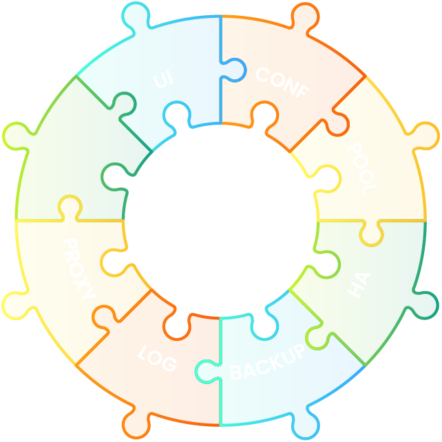

Running Postgres successfully in production requires a whole stack of components related to PostgreSQL -- a curated set of open source components built, verified, and packaged together.
There is an ecosystem of tools built around Postgres that can be used to create a Postgres distribution.
This is what we call the stack of components.

To give a comparison, Postgres is like the Linux kernel of a Linux distribution -- while it sits at the core, it still needs many components around it to provide what a Linux distribution provides.

Choosing the right component of this stack is a challenging task. There are many components and multiple software distributions
that overlap in their functionalities or have pros and cons to take into account before we can choose one over another.
It is required to have a high understanding of all the components in order to choose the ones that fit together and provide a
production-ready Postgres distribution.

Our Postgres distribution is composed of a central core component (Postgres) and some other components that fulfill
requirements in different areas required by the Postgres production distribution.

## Core

The main container used for a Postgres cluster node uses an UBI 8 minimal image as its base image to which a
vanilla PostgreSQL is added. The container uses a persistent storage configured via storage class. Is always deployed with a
sidecar util container to allow access for a system/database administrator.

## Configuration

Running PostgreSQL using the default configuration is usually not a good idea in a production environment. PostgreSQL uses very
conservative defaults, and it must be tuned in order to achieve good performance. There are some places
where you can find more information about Postgres configuration parameters and best practices:

* [Postgres Official Documentation](https://www.postgresql.org/docs/)
* [https://postgresqlco.nf](https://postgresqlco.nf) (see [PostgreSQL Configuration for Humans](https://speakerdeck.com/ongres/postgresql-configuration-for-humans))
* [The Internals of PostgreSQL](http://www.interdb.jp/pg/)

StackGres is tuned by default to achieve better performance than using the default configuration. The user can still
change the configuration based on their needs.

## Connection Pooling

Connecting directly to PostgreSQL does not scale very well.
Once you reach the configured `max_connections` limit (100 per default), connections above this number will be rejected, which must be avoided.
While a lot of enterprise application frameworks offer functionalities to pool their database connections, multiple application deployments hardly ever share their connection pools.

Configuring a very high number of allowed connections doesn't quite solve this issue, as we'll notice that the connection latency increases disproportionately to the load, as shown in the following graph (the green line):

)")

This is due to the fact that PostgreSQL manages one process per connection, which for a high number of connections leads to contention on the CPU cores and operating system scheduling overhead.

For these reasons, it is highly recommended to use a proper connection pooling in front of our database instances.

These are the three common connection pooling solutions for PostgreSQL:

* [PgPool](https://www.pgpool.net)
* [PgBouncer](https://www.pgbouncer.org/)
* [Odyssey](https://github.com/yandex/odyssey)

Now, which one to choose?

The solution chosen by StackGres is PgBouncer.
It is simple enough and stable to be used for connection pooling.
PgBouncer's disadvantage is the lack of multithreading that can lead to CPU saturation when connections increase over a certain limit which depends on the performance of a single CPU's core where it is running.
Odyssey might be a good candidate to replace PgBouncer when the former becomes more mature.

## High Availability

If a Postgres instance goes down or is not working properly, we want our cluster to recover by choosing a working instance
to convert to the new primary and configure all the other instances and the application to point to this new primary. We want
all this to happen without manual intervention.

A high availability solution allows to achieve this. There are multiple solutions to this problem, and it is challenging to chose
one among them:

* [PgPool](https://www.pgpool.net)
* [Repmgr](https://repmgr.org/)
* [Patroni](https://github.com/zalando/patroni)
* [pg_autofailover](https://github.com/citusdata/pg_auto_failover)
* [PAF](https://dalibo.github.io/PAF/)
* [Stolon](https://github.com/sorintlab/stolon)

StackGres chooses Patroni as the HA solution.
It is a well-proved solution that relies on distributed consensus algorithms in order to provide a consistent mechanism for primary instance election.
In particular, Patroni is able to use the same distributed consensus algorithm used by Kubernetes so that it does not require installation of other services.

## Backup and Disaster Recovery

Backup solutions are also an ecosystem with a variety of choice:

* ~~pg_dump~~
* [Barman](https://www.pgbarman.org/)
* [PgBackrest](https://pgbackrest.org/)
* [Wal-e](https://github.com/wal-e/wal-e) / [Wal-g](https://github.com/wal-g/wal-g)
* [pg_probackup](https://github.com/postgrespro/pg_probackup)

Also, where do we store our backups?

* Disk
* Cloud storage

And finally, will our backup work when needed or will it fail?

Wal-g, the successor of Wal-e, is the most complete and lightweight solution to provide both incremental (through the archive
command) and full backup support. Also, it provides out-of-the-box features that allow storing backups in a persistent volume
(using a storage class that supports `ReadWriteMany` access) or a cloud storage such as AWS S3, Google Cloud Storage,
or Azure Blob Storage. Wal-g also allows configuring aspects like bandwidth or disk usage rate.

## Log

We want to store our logs distributed across all our containers in a central location and be able to analyze them when
needed. There is no good solution available for that, so one has to build one. There are [fluentd](https://www.fluentd.org/)
and [Loki](https://grafana.com/oss/loki/), but the latter does not work very well with Postgres. An alternative is to store
all the logs in Postgres using [Timescale](https://github.com/timescale/timescaledb).

## Proxy

How do I locate the primary instance, and what if it changes? How do I obtain traffic [metrics]({})?
It is possible to manage the traffic: duplicate, A/B to test cluster, or event inspect it?

[Envoy](https://www.envoyproxy.io/) is an open source edge and service proxy, designed for cloud-native applications. It is
extensible in order to provide advanced functionality based on the actual traffic or on connection characteristic.
For example, the Postgres metrics could be parsed in order to offer stats, or the TLS certificate can be configured.

Envoy is also capable of [exporting metrics]({}) using the well-established Prometheus format.

OnGres Inc. sponsors the Envoy Proxy project with contributions such as exposing PostgreSQL [monitoring metrics](https://www.envoyproxy.io/docs/envoy/latest/configuration/listeners/network_filters/postgres_proxy_filter#statistics) and implementing the [SSL termination support](https://www.envoyproxy.io/docs/envoy/latest/api-v3/extensions/filters/network/postgres_proxy/v3alpha/postgres_proxy.proto#envoy-v3-api-field-extensions-filters-network-postgres-proxy-v3alpha-postgresproxy-terminate-ssl).

## Monitoring

Which monitoring solution can we use to monitor a Postgres cluster?

* [Zabbix](https://www.zabbix.com/)
* [Okmeter](https://okmeter.io/)
* [Pganalyze](https://pganalyze.com/)
* [Pgwatch2](https://github.com/cybertec-postgresql/pgwatch2)
* [PoWA](https://github.com/powa-team/powa)
* [New Relic](https://newrelic.com/)
* [DataDog](https://www.datadoghq.com/)
* [Prometheus](https://prometheus.io/)

StackGres' approach here is to enable as much monitoring solution as possible. Currently, only Prometheus can connect
to StackGres stats using the [PostgreSQL Server Exporter](https://github.com/wrouesnel/postgres_exporter)
and integrates as a sidecar offering an auto binding mechanism if Prometheus is installed using the [Prometheus Operator](https://github.com/prometheus-operator/prometheus-operator).

Please take into account that Prometheus is an external dependency and that StackGres expects that you install and configure it separately.

Of course, StackGres provides an option to deploy Prometheus alongside the StackGres Operator
as part of the [Helm chart]({})
and you can follow the steps described there to set the required parameters so that the monitoring integration works as expected.
Please read and review the steps and notes for a successful installation.

Please also note that Prometheus will be removed from the Helm chart at some point, so the actual instructions will change and become obsolete.

### Grafana Integration

By default, the [Prometheus Operator](https://github.com/coreos/prometheus-operator) Helm chart comes
 with Grafana. StackGres offers an integration that allows monitoring a StackGres cluster pod
 directly from the StackGres UI. There are various options to achieve this.

StackGres includes two ways:

- [Automatic integration]({})
- [Manual integration]({})

Some manual steps are required in order to achieve such integration.

## User Interface

There are some user interfaces available to interact with Postgres, such as [DBeaver](https://dbeaver.io/) which allows looking at the database content
and configuration. We need a user interface that is capable of manage an entire cluster. How do I list the clusters?
How many nodes does a cluster have? What is the replication status? How many computing resources are used by a node? How to get
the monitoring information of a particular node?

StackGres provides a user interface via web and CLI, which is able to monitor and interact with the created StackGres clusters. It allows
performing basic and advanced tasks like list/get/create/update/delete a cluster or execute a switchover or a backup recovery.

