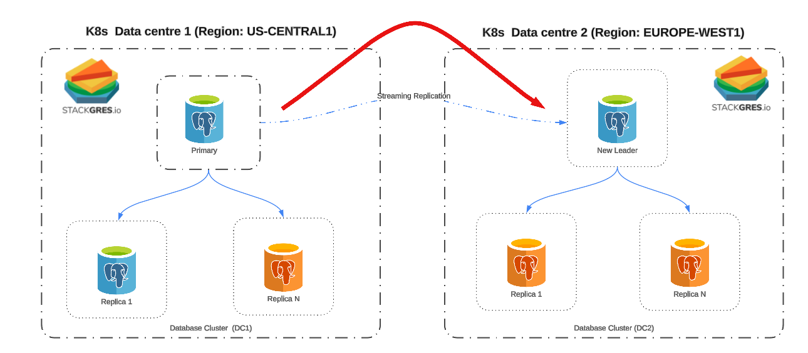

Geo-redundancy is the distribution of mission-critical components, across multiple data centers, which reside in different geographic locations.
Geo-redundancy acts as a safety net in case your primary site fails or in the event of a disaster or an outage that impacts an entire region.

The objective of this mechanism is to guarantee that the applications continue working in case of a data center failure and that there is no or minimal data loss in such a case. The main datacenter cluster is replicated by a secondary cluster also called standby cluster. 
All the applications have to be duplicated in all the data centers to be equal and receive the traffic and perform as expected in the event of a failover.

The DNS entry points play an essential part in the components, in case of a data center failure the DNS must change and point to the entry point of the DR data center where all the database standby clusters will become the primary databases allowing Read/Writes operations. The sync process before the failover will ensure the integrity of the database and minimize any possible data loss.

## Achitecture overview

The next diagram represents the architecture of the database components.

The Data center 1 is located in the region `us-central1` and is the main one, all Read/Write traffic will be received here. The Data center 2 is the DR data center (`europe-west1`), all the data from the primary database is replicated using streaming replication and the main instance acts as a Standby Leader and can only receive Read-Only transactions.

## Failover or Switchover

There are two possible ways to change from one data center to another. The first one is from an unwanted situation such as a failure in the main data center, the second is a planned situation like maintenance or role changes between data centers. 

### Failover

StackGres already has an HA mechanism, so in case of a failure in the primary instance, this will automatically elect a new leader between the cluster instances in the same datacenter. No manual intervention is needed:

When a datacenter fails the operation has to be performed manually instead: 

### Switchover

A switchover is a planned situation where it is required to change the leadership of the database cluster. This is a manual process that can be done at any moment. 

