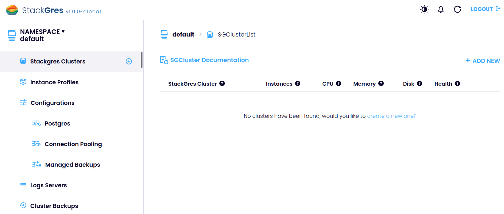

StackGres (the operator and associated components) may be installed on any namespace. It is recommended to create a
dedicated namespace for StackGres:

```bash
kubectl create namespace stackgres
```

StackGres recommended installation is performed from the published Helm chart. The following command will install
StackGres with Helm3, allow Grafana integration with StackGres Web Console, and exposing that Web Console via a load
balancer:

```bash
helm install --namespace stackgres stackgres-operator \
	--set grafana.autoEmbed=true \
        --set-string grafana.webHost=prometheus-grafana.monitoring \
        --set-string grafana.user=admin \
        --set-string grafana.password=prom-operator \
        --set-string adminui.service.type=LoadBalancer \
        /helm/stackgres-operator.tgz
```

Please refer to [Helm chart parameters]({}) for further
customization of the above Helm parameters. The `grafana` parameters above contain the default values for the
installation detailed on the
[Prometheus and Grafana prerequisite section]({}) section.
Replace them for your custom installation parameters, if needed.

Note that using `adminui.service.type=LoadBalancer` will create a network load balancer, which may incur in additional
costs. You may alternatively use `ClusterIP` if that's your preference.

StackGres installation may take a few minutes. The output will be similar to:

```plain
NAME: stackgres-operator
LAST DEPLOYED: Mon Mar  1 00:25:10 2021
NAMESPACE: stackgres
STATUS: deployed
REVISION: 1
TEST SUITE: None
NOTES:
Release Name: stackgres-operator
StackGres Version: 1.0.0-alpha1

   _____ _             _     _____
  / ____| |           | |   / ____|
 | (___ | |_ __ _  ___| | _| |  __ _ __ ___  ___
  \___ \| __/ _` |/ __| |/ / | |_ | '__/ _ \/ __|
  ____) | || (_| | (__|   <| |__| | | |  __/\__ \
 |_____/ \__\__,_|\___|_|\_\\_____|_|  \___||___/
                                  by OnGres, Inc.

Check if the operator was successfully deployed and is available:

    kubectl describe deployment -n stackgres stackgres-operator

    kubectl wait -n stackgres deployment/stackgres-operator --for condition=Available

Check if the restapi was successfully deployed and is available:

    kubectl describe deployment -n stackgres stackgres-restapi

    kubectl wait -n stackgres deployment/stackgres-restapi --for condition=Available

To access StackGres Operator UI from localhost, run the below commands:

    POD_NAME=$(kubectl get pods --namespace stackgres -l "app=stackgres-restapi" -o jsonpath="{.items[0].metadata.name}")

    kubectl port-forward "$POD_NAME" 8443:9443 --namespace stackgres

Read more about port forwarding here: http://kubernetes.io/docs/user-guide/kubectl/kubectl_port-forward/

Now you can access the StackGres Operator UI on:

https://localhost:8443

To get the username, run the command:

    kubectl get secret -n stackgres stackgres-restapi --template '{{ printf "username = %s\n" (.data.k8sUsername | base64decode) }}'

To get the generated password, run the command:

    kubectl get secret -n stackgres stackgres-restapi --template '{{ printf "password = %s\n" (.data.clearPassword | base64decode) }}'

Remember to remove the generated password hint from the secret to avoid security flaws:

    kubectl patch secrets --namespace stackgres stackgres-restapi --type json -p '[{"op":"remove","path":"/data/clearPassword"}]'
```

Several useful commands are provided as part of the Helm installation output. Let's use them to connect to the StackGres
Web Console. If the `LoadBalancer` parameter was used, let's query the URL of the created load balancer, by querying the
K8s Service created:

```bash
kubectl -n stackgres get svc --field-selector metadata.name=stackgres-restapi             
```

Note: StackGres deploys the Web Console with the service of the Rest API, hence the query above.

<pre>
NAME                TYPE           CLUSTER-IP       EXTERNAL-IP                                                               PORT(S)         AGE
stackgres-restapi   LoadBalancer   10.100.194.154   <b class="colorHighlight">aa82c8ec1082142cba68d9f19980478d-2039466138.us-east-2.elb.amazonaws.com</b>   443:30010/TCP   20m
</pre>

Note the external IP (probably a DNS name, like above) and use it prepended by `https://` to access the Web Console.
By default StackGres would have used a self-signed SSL certificate, so it is expected that you will be presented with a
warning from the web browser. Accept and continue to the login dialogue.

You can get the username and password for the Web Console from the commands output from StackGres Helm chart
installation. Unless you changed it via helm parameters, the username will be `admin`. The password is dynamically
generated and can be queried via the following command (pipe or redirect if on a non-public environment):

```bash
kubectl get secret -n stackgres stackgres-restapi --template '{{ print (.data.clearPassword | base64decode) }}'
```

You should see a web UI similar to:



If you prefer, it supports dark mode. Just click the icon on the top right bar.
