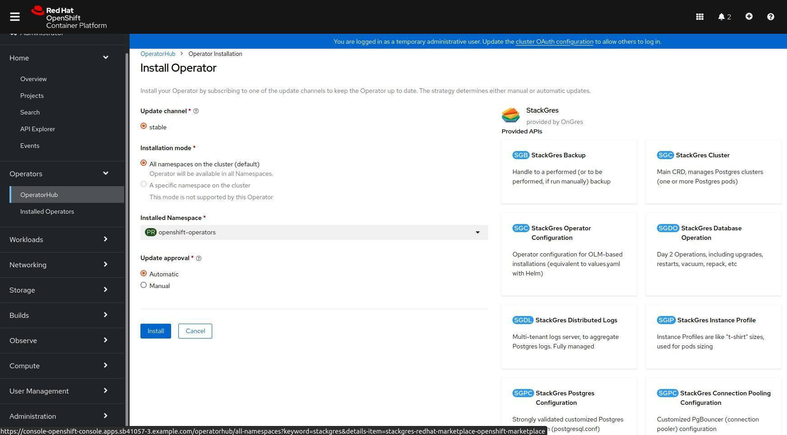

StackGres recommended installation is performed from the published Helm chart or using through OperatorHub (this second option is only available if [OLM](https://olm.operatorframework.io/) is installed). Some parameters may be passed to the default installation, which basically can be summarized as:
* Username and password to access Grafana (this is used by StackGres to install StackGres specific dashboards as well as to embed Grafana into the Web Console). If you installed Prometheus following the previous step, they will be at their default values (username: `admin`, password: `prom-operator`). Also the Grafana host where it is running (by default, exposed as a service at `prometheus-grafana.namespace`, i.e. `prometheus-grafana.monitoring` here).
* How to expose the Web Console. Select `LoadBalancer` if using a cloud Kubernetes cluster or your Kubernetes environment supports creating load balancers. Otherwise, select `ClusterIP` (in this case you will later need to do a port forward to access the Web Console).

## Installation with Helm

Proceed to install StackGres:

- Add the helm repo:

```
helm repo add stackgres-charts https://stackgres.io/downloads/stackgres-k8s/stackgres/helm/
```

- Install the Operator

> StackGres (the operator and associated components) may be installed on any namespace but we recommended to create a dedicated namespace (`stackgres` in this case).

```
helm install --create-namespace --namespace stackgres stackgres-operator \
    --set grafana.autoEmbed=true \
    --set-string grafana.webHost=prometheus-operator-grafana.monitoring \
    --set-string grafana.secretNamespace=monitoring \
    --set-string grafana.secretName=prometheus-operator-grafana \
    --set-string grafana.secretUserKey=admin-user \
    --set-string grafana.secretPasswordKey=admin-password \
    --set-string adminui.service.type=LoadBalancer \
    stackgres-charts/stackgres-operator
```
> You can specify the version to the Helm command. For example you may add `--version 1.0.0` to install verion `1.0.0`.

Note that using `adminui.service.type=LoadBalancer` will create a network load balancer, which may incur in additional costs. You may alternatively use `ClusterIP` if that's your preference.

> In some managed Kubernetes clusters and Kubernetes distribution a LoadBalancer may not be available, in such case replace `LoadBalancer` for `NodePort` and 
>  you will be able to connect directly to the node port that will be assigned to the service. To retrieve such port use the following command:

```
kubectl get service -n stackgres stackgres-restapi --template '{{ (index .spec.ports 0).nodePort }}{{ printf "\n" }}'
```

StackGres installation may take a few minutes. The output will be similar to:

```plain
NAME: stackgres-operator
LAST DEPLOYED: Mon Oct 1 00:25:10 2021
NAMESPACE: stackgres
STATUS: deployed
REVISION: 1
TEST SUITE: None
NOTES:
Release Name: stackgres-operator
StackGres Version: 1.0.0

   _____ _             _     _____
  / ____| |           | |   / ____|
 | (___ | |_ __ _  ___| | _| |  __ _ __ ___  ___
  \___ \| __/ _` |/ __| |/ / | |_ | '__/ _ \/ __|
  ____) | || (_| | (__|   <| |__| | | |  __/\__ \
 |_____/ \__\__,_|\___|_|\_\\_____|_|  \___||___/
                                  by OnGres, Inc.

Check if the operator was successfully deployed and is available:

    kubectl describe deployment -n stackgres stackgres-operator

    kubectl wait -n stackgres deployment/stackgres-operator --for condition=Available

Check if the restapi was successfully deployed and is available:

    kubectl describe deployment -n stackgres stackgres-restapi

    kubectl wait -n stackgres deployment/stackgres-restapi --for condition=Available

To access StackGres Operator UI from localhost, run the below commands:

    POD_NAME=$(kubectl get pods --namespace stackgres -l "app=stackgres-restapi" -o jsonpath="{.items[0].metadata.name}")

    kubectl port-forward "$POD_NAME" 8443:9443 --namespace stackgres

Read more about port forwarding here: http://kubernetes.io/docs/user-guide/kubectl/kubectl_port-forward/

Now you can access the StackGres Operator UI on:

https://localhost:8443

To get the username, run the command:

    kubectl get secret -n stackgres stackgres-restapi --template '{{ printf "username = %s\n" (.data.k8sUsername | base64decode) }}'

To get the generated password, run the command:

    kubectl get secret -n stackgres stackgres-restapi --template '{{ printf "password = %s\n" (.data.clearPassword | base64decode) }}'

Remember to remove the generated password hint from the secret to avoid security flaws:

    kubectl patch secrets --namespace stackgres stackgres-restapi --type json -p '[{"op":"remove","path":"/data/clearPassword"}]'
```

## Installation with OperatorHub

Proceed to install StackGres:

- Install the Operator

> StackGres (the operator and associated components) may be installed by creating the Namespace, an OperatorGroup and a Subscription

```
cat << EOF | kubectl create -f -
apiVersion: v1
kind: Namespace
metadata:
  name: stackgres
apiVersion: operators.coreos.com/v1
kind: OperatorGroup
metadata:
  name: stackgres
  namespace: stackgres
spec:
  targetNamespaces:
  - stackgres
---
apiVersion: operators.coreos.com/v1alpha1
kind: Subscription
metadata:
  name: stackgres
  namespace: stackgres
spec:
  channel: stable 
  name: stackgres 
  source: community-operators 
  sourceNamespace: olm
  startingCSV: stackgres.v1.4.3
  installPlanApproval: Automatic
EOF
```

> You can specify the version in the startingCSV field. For example you may set it to `stackgres.v1.0.0` to install verion `1.0.0`.

StackGres installation may take a few minutes. To properly wait for the installation to complete monitor the output of the following command until the STATUS field become "deployed":

```
until helm status -n stackgres stackgres | grep -qxF 'STATUS: deployed'; do sleep 1; done
helm status -n stackgres stackgres
```

StackGres installation may take a few minutes. The output will be similar to:

```plain
NAME: stackgres
LAST DEPLOYED: Mon Oct 1 00:25:10 2021
NAMESPACE: stackgres
STATUS: deployed
REVISION: 1
TEST SUITE: None
NOTES:
Release Name: stackgres
StackGres Version: 1.0.0

   _____ _             _     _____
  / ____| |           | |   / ____|
 | (___ | |_ __ _  ___| | _| |  __ _ __ ___  ___
  \___ \| __/ _` |/ __| |/ / | |_ | '__/ _ \/ __|
  ____) | || (_| | (__|   <| |__| | | |  __/\__ \
 |_____/ \__\__,_|\___|_|\_\\_____|_|  \___||___/
                                  by OnGres, Inc.

Check if the operator was successfully deployed and is available:

    kubectl describe deployment -n stackgres stackgres

    kubectl wait -n stackgres deployment/stackgres --for condition=Available

Check if the restapi was successfully deployed and is available:

    kubectl describe deployment -n stackgres stackgres-restapi

    kubectl wait -n stackgres deployment/stackgres-restapi --for condition=Available

To access StackGres Operator UI from localhost, run the below commands:

    POD_NAME=$(kubectl get pods --namespace stackgres -l "app=stackgres-restapi" -o jsonpath="{.items[0].metadata.name}")

    kubectl port-forward "$POD_NAME" 8443:9443 --namespace stackgres

Read more about port forwarding here: http://kubernetes.io/docs/user-guide/kubectl/kubectl_port-forward/

Now you can access the StackGres Operator UI on:

https://localhost:8443

To get the username, run the command:

    kubectl get secret -n stackgres stackgres-restapi --template '{{ printf "username = %s\n" (.data.k8sUsername | base64decode) }}'

To get the generated password, run the command:

    kubectl get secret -n stackgres stackgres-restapi --template '{{ printf "password = %s\n" (.data.clearPassword | base64decode) }}'

Remember to remove the generated password hint from the secret to avoid security flaws:

    kubectl patch secrets --namespace stackgres stackgres-restapi --type json -p '[{"op":"remove","path":"/data/clearPassword"}]'
```

> Modify the configuration by patching the stackgres SGConfig

```
cat << EOF | kubectl patch -n openshift-operators sgconfig stackgres --type merge -p "$(cat)"
spec:
  grafana:
    autoEmbed: true
    secretName: prometheus-operator-grafana
    secretNamespace: monitoring
    secretPasswordKey: admin-password
    secretUserKey: admin-user
    webHost: prometheus-operator-grafana.monitoring
  adminui:
    service:
      type: LoadBalancer
EOF
```

> In some managed Kubernetes clusters and Kubernetes distribution a LoadBalancer may not be available, in such case replace `LoadBalancer` for `NodePort` and 
>  you will be able to connect directly to the node port that will be assigned to the service. To retrieve such port use the following command:

```
kubectl get service -n stackgres stackgres-restapi --template '{{ (index .spec.ports 0).nodePort }}{{ printf "\n" }}'
```

### Installation with OperatorHub on OpenShift 4.x

> On OpenShift 4.x the operator will be installed in the `openthift-operators` namespace so make sure to replace `stackgres` with `openshift-operators` in all the commands of this tutorial.

` `

> Since in OpenShift the namespace `openshift-operators` is already created you only need to create the Subscription:

```
cat << EOF | kubectl create -f -
apiVersion: operators.coreos.com/v1alpha1
kind: Subscription
metadata:
  name: stackgres
  namespace: openshift-operators 
spec:
  channel: stable 
  name: stackgres 
  source: redhat-marketplace
  sourceNamespace: openshift-marketplace
  startingCSV: stackgres.v1.4.3
  installPlanApproval: Automatic
EOF
```

> Alternatively you may install the StackGres Operator from the OpenShift Web Console by following this steps:
>
> 1. Search the StackGres Operator from the OperatorHub tab
>     
> 2. After selecting it click on the "Install" button
>     
> 3. Then use the default setting and click on "Install" button
>     

` `

> To watch the operator installation you may look at Pods in the `openshift-operators` namespace:

```
kubectl get pod -n openshift-operators --watch
```

> Modify the configuration by patching the stackgres SGConfig:

```
cat << EOF | kubectl patch -n openshift-operators sgconfig stackgres --type merge -p "$(cat)"
spec:
  grafana:
    autoEmbed: true
    secretName: grafana-admin-credentials
    secretNamespace: grafana
    secretPasswordKey: GF_SECURITY_ADMIN_PASSWORD
    secretUserKey: GF_SECURITY_ADMIN_USER
    webHost: grafana-service.grafana:3000
  adminui:
    service:
      type: LoadBalancer
EOF
```

> In OpenShift a LoadBalancer may not be available, in such case replace `LoadBalancer` for `NodePort` and 
>  you will be able to connect directly to the node port that will be assigned to the service. To retrieve such port use the following command:

```
kubectl get service -n openshift-operators stackgres-restapi --template '{{ (index .spec.ports 0).nodePort }}{{ printf "\n" }}'
```

> *IMPORTANT*: When `SGCluster.spec.prometheusAutobind` is set to `true` StackGres create some PodMonitors in the same namespace as the `Prometheus` custom resources. This approach has to avoided in OpenShift since the PodMonitor will be created for the Prometheus that is used only for internal OpenShift metric storage. To correct this PodMonitors have to be created manually in the cluster namespace and the `SGCluster.spec.prometheusAutobind` have to be set to `false` in order to avoid duplicate entries. You may create a script named `create-podmonitors.sh` as follow:

```
cat << 'SCRIPT_EOF' > create-podmonitors.sh
#!/bin/sh

usage() {
  >&2 echo 'Usage: $0 [-n <cluster namespace>] <sgcluster name>'
  exit 1
}

NAMESPACE=default
SGCLUSTER=default

while [ "$#" -gt 0 ]
do
  case "$1" in
    (-n):
      shift
      NAMESPACE="$1"
      shift
      ;;
    (*):
      if [ -z "$1" ]
      then
        usage
      fi
      SGCLUSTER="$1"
      shift
      ;;
  esac
done

if ! kubectl get sgcluster -n "$NAMESPACE" "$SGCLUSTER" > /dev/null
then
  usage
fi

cat << EOF | kubectl create -n "$NAMESPACE" -f -
apiVersion: v1
items:
- apiVersion: monitoring.coreos.com/v1
  kind: PodMonitor
  metadata:
    name: $SGCLUSTER-envoy
  spec:
    podMetricsEndpoints:
    - path: /stats/prometheus
      port: envoy
    selector:
      matchLabels:
        app: StackGresCluster
        stackgres.io/cluster: "true"
        stackgres.io/cluster-name: $SGCLUSTER
- apiVersion: monitoring.coreos.com/v1
  kind: PodMonitor
  metadata:
    name: $SGCLUSTER-postgres-exporter
  spec:
    podMetricsEndpoints:
    - port: pgexporter
    selector:
      matchLabels:
        app: StackGresCluster
        stackgres.io/cluster: "true"
        stackgres.io/cluster-name: $SGCLUSTER
kind: List
metadata:
  resourceVersion: ""
EOF
SCRIPT_EOF
```

> And run it each time a cluster is created:

```
sh create-podmonitors.sh -n "<cluster namespace>" "<cluster name>"
```

## Connecting to the Web Console

Several useful commands are provided as part of the Helm installation output. Let's use them to connect to the StackGres
Web Console. If the `LoadBalancer` parameter was used, let's query the URL of the created load balancer, by querying the
K8s Service created:

```
kubectl -n stackgres get svc --field-selector metadata.name=stackgres-restapi

NAME                TYPE           CLUSTER-IP      EXTERNAL-IP                                                              PORT(S)         AGE
stackgres-restapi   LoadBalancer   10.100.165.13   aa372eefc1630469f95e64d384caa004-833850176.eu-west-1.elb.amazonaws.com   443:32194/TCP   47m
```

The Web Console is exposed as part of the `stackgres-restapi` service. Here we can see it is of type `LoadBalancer`, and exposed at a given URL. Open this URL in the web browser prefixing it with `https://` , as in:

```
https://aa372eefc1630469f95e64d384caa004-833850176.eu-west-1.elb.amazonaws.com
```

If your service is exposed as `ClusterIP`, you can instead use port forwarding to access the Web Console. Find the name of the `restapi` pod in either of the following ways, at your preference:

```
POD_NAME=$(kubectl get pods --namespace stackgres -l "app=stackgres-restapi" -o jsonpath="{.items[0].metadata.name}")
```

And then do the port-forward to your localhost on port 8443, which you can access from the web browser on URL `https://localhost:8443`:

```
kubectl port-forward "$POD_NAME" 8443:9443 --namespace stackgres
```
Once you open the Web Console in the browser, you will need to accept to continue to the page. StackGres Web Console uses by default a self-signed certificate, which is generated during the installation. You can customize it during the installation, or install the Web Console only via HTTP and expose it via an _Ingress_ controller. But for now, proceed. The default administrator's username is `admin`, and the password is generated automatically but can be obtained via the following command:

```
kubectl get secret -n stackgres stackgres-restapi --template '{{ printf "%s\n" (.data.clearPassword | base64decode) }}'
```

You should see something like the following screenshot (where Dark Mode was dectivated!):


