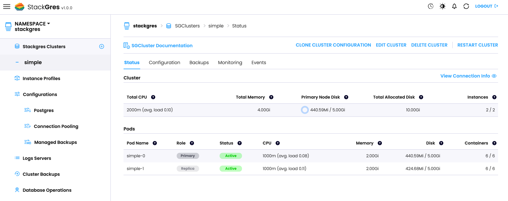

StackGres is operated via CRDs (here is the full [CRD Referece]({})). As such, you don't
need to install any separate tool or `kubectl` plugin, and it allows you to easily create GitOps workflows. StackGres
abstracts away all the internals and complexity of creating a complete Postgres cluster with high availability,
connection pooling, tuned parameters by default, monitoring, and many others; and exposes a very simple, high level
interface as part of its CRDs.

The main CRD that drives Postgres cluster creation is called
[SGCluster]({}). Here we will create a simple one, which will
include several values and parameters by default. The next section will create a more advanced cluster, while keeping
the simplicity and hiding away the Postgres expertise required.

Create the file `simple-cluster.yaml`:

```yaml
apiVersion: stackgres.io/v1
kind: SGCluster
metadata:
  name: simple
spec:
  instances: 2
  postgresVersion: 'latest'
  pods:
    persistentVolume:
      size: '5Gi'
```

And deploy to Kubernetes:

```bash
kubectl apply -f simple-cluster.yaml
```

This operation will take some around a minute. At the end, you will be able to see two instances (pods) created on the
default namespace:

```bash
kubectl get pods
```

```plain
NAME       READY   STATUS    RESTARTS   AGE
simple-0   5/5     Running   0          3m21s
simple-1   5/5     Running   0          2m5s
```

You can also check the pod creation from the Web Console:



To connect to the cluster you have several options:

1. Run the Postgres client `psql` locally to the pod. One of the StackGres pod's containers is called `postgresql-util`,
and contains administrative tools. Run the command:

    ```bash
    kubectl exec -it simple-0 -c postgres-util -- psql
    ```

    ```plain
    psql (12.4 OnGres Inc.)
    Type "help" for help.

    postgres=#
    ```

1. Via the exposed Kubernetes service. Services are named `${cluster_name}-[primary|replicas]`. The `-primary` service
always connect to the primary (read-write) node, and the `-replicas` service to the load-balanced set of replicas
(read-only). We may create any pod that contains a Postgres client, and then connect using the service as a DNS for the
Postgres host. We will also need to get the generated superuser password:

    ```bash
    kubectl get secret simple --template '{{ (index .data "superuser-password" | base64decode) }}'

    kubectl run psql --image postgres --env="POSTGRES_PASSWORD=whatever"

    kubectl exec -it psql -- psql -h simple-primary postgres postgres
    ```

    Cleanup:

    ```bash
    kubectl delete pod psql
    ```

When connecting via the `postgres-util`, how do we know which pod is the primary? StackGres uses
[Patroni](https://github.com/zalando/patroni) for high availability. The main pod's container (called `patroni`)
contains the Patroni CLI, which can be used to query the status of the cluster and the primary ("leader" in Patroni's
terminology) node:

```bash
kubectl exec -t simple-0 -c patroni -- patronictl list
```

```plain
+ Cluster: simple (6934472607315959877) --+---------+----+-----------+
|  Member  |         Host        |  Role  |  State  | TL | Lag in MB |
+----------+---------------------+--------+---------+----+-----------+
| simple-0 |  192.168.7.119:7433 | Leader | running |  1 |           |
| simple-1 | 192.168.73.238:7433 |        | running |  1 |         0 |
+----------+---------------------+--------+---------+----+-----------+
```

Finally, let's delete the cluster, we will be creating more advanced ones in the next section:

```bash
kubectl delete -f simple-cluster.yaml
```
