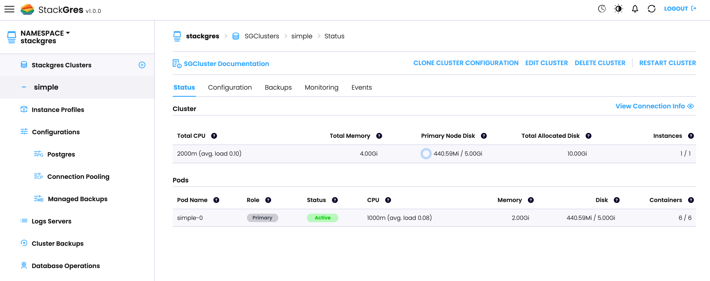

## Cluster creation

StackGres is operated via CRDs (here is the full [CRD Referece]({})). As such, you don't need to install any separate tool or `kubectl` plugin, and it allows you to easily create GitOps workflows. StackGres abstracts away all the internals and complexity of creating a complete Postgres cluster with high availability,
connection pooling, tuned parameters by default, monitoring, and many others; and exposes a very simple, high level interface as part of its CRDs.

The main CRD that drives Postgres cluster creation is called [SGCluster]({}). Here we will create a simple one, which will
include several values and parameters by default. The next section will create a more advanced cluster, while keeping the simplicity and hiding away the Postgres expertise required.

Create the file `simple.yaml`:

```yaml
apiVersion: stackgres.io/v1
kind: SGCluster
metadata:
  name: simple
spec:
  instances: 1
  postgres:
    version: 'latest'
  pods:
    persistentVolume:
      size: '5Gi'
```

The contents of the file should be easily understandable. A StackGres cluster with name `simple` will be created in the `default` namespace (none specified), with one StackGres instance (which will lead to one Pod), using the `latest` Postgres version --this is a handy shortcut you may use. StackGres will internally resolve this to the latest version available, and modify your CR to note the specific version used. For each Pod, a 5Gi _PersistentVolume_ will be created and attached to it.

```bash
kubectl apply -f simple.yaml -n stackgres
sgcluster.stackgres.io/simple created
```

This operation will take some around a minute. At the end, you will be able to see one instance (Pod) created on the default namespace. You can track the progress with:

```bash
$ kubectl get pods -n stackgres --watch
NAME       READY   STATUS     RESTARTS   AGE
simple-0   0/6     Pending    0          5s
simple-0   0/6     Pending    0          6s
simple-0   0/6     Init:0/5   0          6s
simple-0   0/6     Init:1/5   0          26s
...
```

You can also check the Pod creation from the Web Console:



When the process finished, you should see one Pod with 6 containers:

```bash
$ kubectl get pods
NAME       READY   STATUS    RESTARTS   AGE
simple-0   6/6     Running   0          82s
```

You should be able to see the resolved Postgres version and other details about your StackGres cluster by inspecting the created CR (Custom Resource):

```bash
kubectl describe sgcluster simple -n stackgres 
```

## Accessing Postgres

Now it's time to connect to Postgres. In its simplest form, we can do that by running the Postgres command line, `psql`, in one of the containers of the pod. StackGres creates within the pods a container called `postgres-util` with usual Postgres administration tools, including `psql`. Since this container runs in the same pod, it uses Unix Domain Sockets to connect to the Postgres instance, and leverages Postgres `peer` authentication method, that will authenticate the user via the operating system username, without requiring any password:


```bash
$ kubectl exec -it simple-0 -n stackgres -c postgres-util -- psql
psql (14.0 OnGres Inc.)
Type "help" for help.

postgres=# 

```

Here you have your Postgres database! Feel free to play around with it. You can exit using CTRL+D or `\q`.

We can actually create a database and some data. Within the previous Postgres console you can run the following commands

```sql
create database hol;
\c hol
create table hol1 as select * from generate_series(1,1000*1000);
\dt+
```

Now connect to the replica and verify that it is in recovery (i.e. read-only mode) and that it has replicated the database and the data:

```
$ kubectl exec -it simple-1 -n stackgres -c postgres-util -- psql
```

(note, we're connecting to `simple-1`, the replica! If `simple-1` is not the replica (it may happen), see the next section below to consult with Patroni who is the replica).

```sql
postgres=# select pg_is_in_recovery();
 pg_is_in_recovery 
-------------------
 t
(1 row)

postgres=# \c hol
You are now connected to database "hol" as user "postgres".
hol=# \dt+
                   List of relations
 Schema | Name | Type  |  Owner   | Size  | Description 
--------+------+-------+----------+-------+-------------
 public | hol1 | table | postgres | 35 MB | 
(1 row)
```

## Patroni and automated failover

StackGres uses internall a software called [Patroni](https://github.com/zalando/patroni) to handle high availability and automated failover. It's handled for you, you shouldn't even care about it. Feel free to skip this section if you don't want to know about Patorni. But if you do, you can query Patroni status easily by running `patronictl` on `patroni`'s container:

```
$ kubectl exec -it simple-0 -n stackgres -c patroni -- patronictl list 
+ Cluster: simple (6979461716096839850) ---+---------+----+-----------+
| Member   | Host                | Role    | State   | TL | Lag in MB |
+----------+---------------------+---------+---------+----+-----------+
| simple-0 | 192.168.59.169:7433 | Leader  | running |  1 |           |
| simple-1 | 192.168.12.150:7433 | Replica | running |  1 |         0 |
+----------+---------------------+---------+---------+----+-----------+
```

Here you can see the two nodes, that `simple-0` is the leader node, the Postgres timeline and the lag. Let's trigger now a failover. For example, let's kill the `simple-0` pod:

```bash
$ kubectl delete pod simple-0 -n stackgres
pod "simple-0" deleted
```

When killed, two things will happen in parallel:
* Kubernetes will create a new pod, which will take over `simple-0`. It will attach the previous disk to this node. This operation may be quite fast (a few seconds).
* The replica (`simple-1`) may or may not fail to see the leader renewing its lock. This is due to the timeout that govern when a leader lock expires. If the pod creation operation takes less time than the lock to expire, the new pod will take over the lock quickly enough to "hold" it, and `simple-0` will remain the primary. For a few seconds, there was no primary. However, the new `simple-0` node will be promoted to a new timeline (2), which will be shown in the Patroni state. If, however, the lock expired before `simple-0` was re-created, `simple-1` will be elected as the new leader.

In any case, the situation should restore back to normal, just with a timeline increased and a potential inversion of the Leader. You may repeat this process as you wish, killing either a primary or replica pod.

```bash
$ kubectl exec -it simple-1 -n stackgres -c patroni -- patronictl list 
+ Cluster: simple (6979461716096839850) ---+---------+----+-----------+
| Member   | Host                | Role    | State   | TL | Lag in MB |
+----------+---------------------+---------+---------+----+-----------+
| simple-0 | 192.168.40.142:7433 | Replica | running |  2 |           |
| simple-1 | 192.168.12.150:7433 | Leader  | running |  2 |         0 |
+----------+---------------------+---------+---------+----+-----------+
```

## Scaling the cluster

Let's add some new Pods to the Postgres cluster. Just edit the `simple.yaml` file and change the number of instances from `1` to `3`:

```yaml
spec:
  instances: 3
```

and then apply it:

```
$ kubectl apply -f simple.yaml -n stackgres
sgcluster.stackgres.io/simple configured
```

In a few seconds, a second and third Pods would have been spinned up:

```
$ kubectl get pods -n stackgres --watch
NAME       READY   STATUS    RESTARTS   AGE
simple-0   6/6     Running   0          55m
simple-1   6/6     Running   0          32s
simple-2   6/6     Running   0          61s
```

And Patroni should also reflect its status as a new replica:

```
$ kubectl exec -it simple-0 -n stackgres -c patroni -- patronictl list
+ Cluster: simple (6979461716096839850) ---+---------+----+-----------+
| Member   | Host                | Role    | State   | TL | Lag in MB |
+----------+---------------------+---------+---------+----+-----------+
| simple-0 | 192.168.40.142:7433 | Leader  | running |  2 |           |
| simple-1 | 192.168.12.150:7433 | Replica | running |  2 |         0 |
| simple-2 | 192.168.71.214:7433 | Replica | running |  2 |         0 |
+----------+---------------------+---------+---------+----+-----------+
```

### Scaling with limited resources

By default StackGres enforces some rules and resource requirements and limitatios in order to be production Ready by default. In case you are testing StackGres functionality it is possible to configure StackGres so that it does not prevent Pods from being scheduled in a Kubernetes cluster with insufficient resources.

Normally StackGres requires each Pod of a Postgres cluster to be scheduled on a separate node using a Pod anti affinity rule. To disable such rule you may set the following options:

```yaml
spec:
  nonProductionOptions:
    disableClusterPodAntiAffinity: true
```

Another aspect that may prevent Postgres cluster Pods from being scheduled are the resource requests and limits requirements. To disable such requirements you may set the following options:

```yaml
spec:
  nonProductionOptions:
    disablePatroniResourceRequirements: true
    disableClusterResourceRequirements: true
```

After setting those options you will have to restart the Postgres cluster Pods by simply deleting them (or using a [restart SGDbOps]({})):

```bash
kubectl delete pod -l app=StackGresCluster,stackgres.io/cluster-name=simple
```

## Cleaning up

Let's now delete the cluster for now, we will create more advanced cluster and configurations in the next section.

```
$ kubectl delete sgcluster simple -n stackgres
sgcluster.stackgres.io "simple" deleted
```
