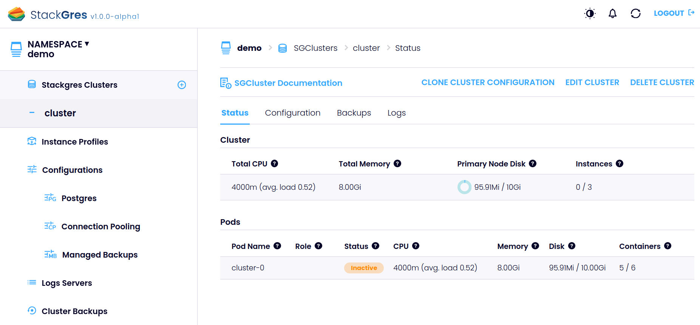

We're now ready to create a more "advanced" cluster. The main differences to the one created before will be:
* We explicitly set the size (t-shirt size) of the cluster.
* We specify custom Postgres and connection pooling (PgBouncer) configurations.
* It performs automated backups, based on the backup configuration.
* It automatically exports metrics to Prometheus. The web console embeds Grafana dashboards.
* Logs are sent to the distributed logs server. The logs are shown in the web console.

Create the file `sgcluster-cluster1.yaml` which references the custom configuration resources created before:

```yaml
apiVersion: stackgres.io/v1
kind: SGCluster
metadata:
  namespace: demo
  name: cluster
spec:
  postgres:
    version: 'latest'
  instances: 3
  sgInstanceProfile: 'size-small'
  pods:
    persistentVolume:
      size: '10Gi'
  configurations:
    sgPostgresConfig: 'pgconfig1'
    sgPoolingConfig: 'poolconfig1'
    sgBackupConfig: 'backupconfig1'
    backups:
    - sgObjectStorage: backupconfig1
      cronSchedule: '*/5 * * * *'
      retention: 6
  distributedLogs:
    sgDistributedLogs: 'distributedlogs'
  prometheusAutobind: true
  nonProductionOptions:
    disableClusterPodAntiAffinity: true
```

and deploy it to Kubernetes:

```plain
kubectl apply -f sgcluster-cluster1.yaml
```

You may notice that now the pods contain one additional container.
This is due to the agent (FluentBit) used to export the logs to the distributed logs server:

```
$ kubectl -n demo get pods
NAME                          READY   STATUS    RESTARTS   AGE
distributedlogs-0             3/3     Running   0          3m16s
hol-0                         7/7     Running   0          98s
hol-1                         7/7     Running   0          72s
```

You can display the configuration and status of the newly created cluster via `kubectl -n demo describe sgcluster cluster`, as well as the web console.

From the web console:



While the cluster is being created, you may notice a blip in the distributed logs server, where a container is restarted.
This behavior is caused by a re-configuration which requires a container restart, and only temporarily pauses the log collection.
No logs are lost, since they are buffered on the source pods.
