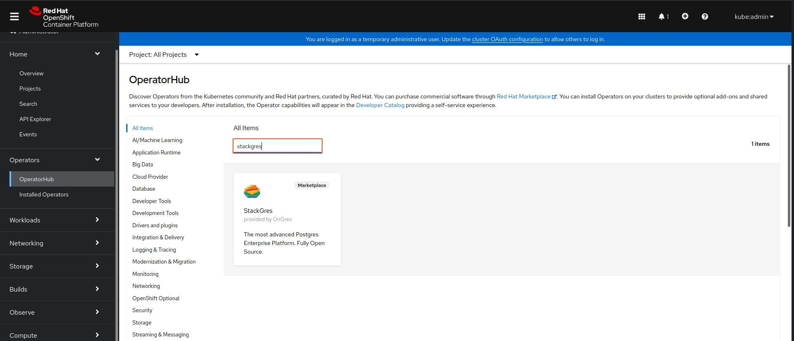
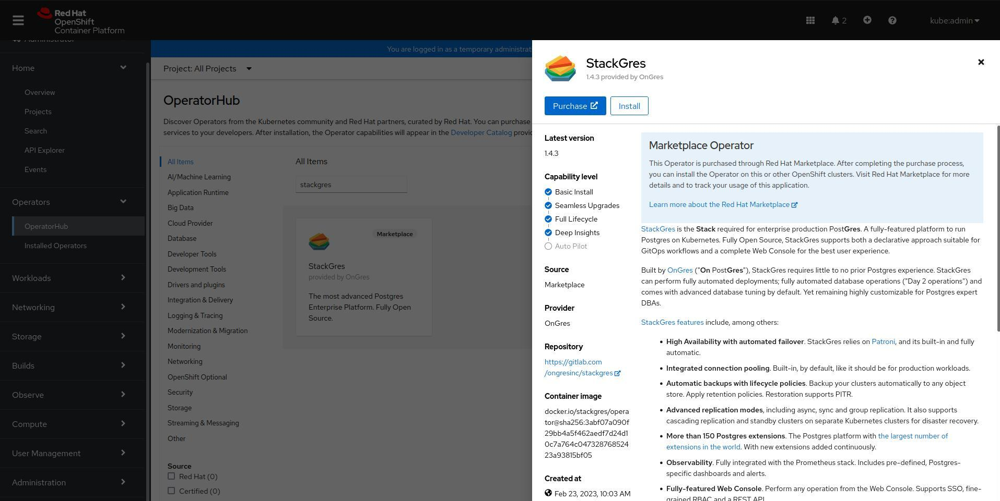

The StackGres operator can be installed via OperatorHub.
On this page, we are going through all the necessary steps to set up a production-grade StackGres environment.

## Installation via OperatorHub

StackGres (the operator and associated components) may be installed by creating the namespace, an operator group, and a subscription.

```
cat << EOF | kubectl create -f -
apiVersion: v1
kind: Namespace
metadata:
  name: stackgres
apiVersion: operators.coreos.com/v1
kind: OperatorGroup
metadata:
  name: stackgres
  namespace: stackgres
spec:
  targetNamespaces:
  - stackgres
---
apiVersion: operators.coreos.com/v1alpha1
kind: Subscription
metadata:
  name: stackgres
  namespace: stackgres
spec:
  channel: stable 
  name: stackgres 
  source: community-operators 
  sourceNamespace: olm
  startingCSV: stackgres.v1.4.3
  installPlanApproval: Automatic
EOF
```

> You can specify the version in the startingCSV field. For example, you may set it to `stackgres.v1.0.0` to install verion `1.0.0`.

The installation may take a few minutes.
To properly wait for the installation to complete monitor the output of the following command until the STATUS field become "deployed":

```
until helm status -n stackgres stackgres | grep -qxF 'STATUS: deployed'; do sleep 1; done
helm status -n stackgres stackgres
```

Finally, the output will be similar to:

```plain
NAME: stackgres
LAST DEPLOYED: Mon Oct 1 00:25:10 2021
NAMESPACE: stackgres
STATUS: deployed
REVISION: 1
TEST SUITE: None
NOTES:
Release Name: stackgres
StackGres Version: 1.0.0

   _____ _             _     _____
  / ____| |           | |   / ____|
 | (___ | |_ __ _  ___| | _| |  __ _ __ ___  ___
  \___ \| __/ _` |/ __| |/ / | |_ | '__/ _ \/ __|
  ____) | || (_| | (__|   <| |__| | | |  __/\__ \
 |_____/ \__\__,_|\___|_|\_\\_____|_|  \___||___/
                                  by OnGres, Inc.

Check if the operator was successfully deployed and is available:

    kubectl describe deployment -n stackgres stackgres

    kubectl wait -n stackgres deployment/stackgres --for condition=Available

Check if the restapi was successfully deployed and is available:

    kubectl describe deployment -n stackgres stackgres-restapi

    kubectl wait -n stackgres deployment/stackgres-restapi --for condition=Available

To access StackGres Operator UI from localhost, run the below commands:

    POD_NAME=$(kubectl get pods --namespace stackgres -l "app=stackgres-restapi" -o jsonpath="{.items[0].metadata.name}")

    kubectl port-forward "$POD_NAME" 8443:9443 --namespace stackgres

Read more about port forwarding here: http://kubernetes.io/docs/user-guide/kubectl/kubectl_port-forward/

Now you can access the StackGres Operator UI on:

https://localhost:8443

To get the username, run the command:

    kubectl get secret -n stackgres stackgres-restapi --template '{{ printf "username = %s\n" (.data.k8sUsername | base64decode) }}'

To get the generated password, run the command:

    kubectl get secret -n stackgres stackgres-restapi --template '{{ printf "password = %s\n" (.data.clearPassword | base64decode) }}'

Remember to remove the generated password hint from the secret to avoid security flaws:

    kubectl patch secrets --namespace stackgres stackgres-restapi --type json -p '[{"op":"remove","path":"/data/clearPassword"}]'
```

Modify the configuration by patching the stackgres SGConfig

```
cat << EOF | kubectl patch -n openshift-operators sgconfig stackgres --type merge -p "$(cat)"
spec:
  grafana:
    autoEmbed: true
    secretName: prometheus-operator-grafana
    secretNamespace: monitoring
    secretPasswordKey: admin-password
    secretUserKey: admin-user
    webHost: prometheus-operator-grafana.monitoring
  adminui:
    service:
      type: LoadBalancer
EOF
```

> In some managed Kubernetes clusters and Kubernetes distribution a LoadBalancer may not be available, in such case replace `LoadBalancer` for `NodePort` and
>  you will be able to connect directly to the node port that will be assigned to the service. To retrieve such port use the following command:

```
kubectl get service -n stackgres stackgres-restapi --template '{{ (index .spec.ports 0).nodePort }}{{ printf "\n" }}'
```

### Installation on OpenShift 4.x

On OpenShift 4.x, the operator will be installed in the `openshift-operators` namespace so make sure to replace `stackgres` with `openshift-operators` in all the commands of this tutorial.

Since in OpenShift the namespace `openshift-operators` is already created you only need to create the Subscription:

```
cat << EOF | kubectl create -f -
apiVersion: operators.coreos.com/v1alpha1
kind: Subscription
metadata:
  name: stackgres
  namespace: openshift-operators 
spec:
  channel: stable 
  name: stackgres 
  source: redhat-marketplace
  sourceNamespace: openshift-marketplace
  startingCSV: stackgres.v1.4.3
  installPlanApproval: Automatic
EOF
```

> Alternatively you may install the StackGres Operator from the OpenShift Web Console by following these steps:
>
> 1. Search the StackGres Operator from the OperatorHub tab
     >     
> 2. After selecting it click on the "Install" button
     >     
> 3. Then use the default setting and click on "Install" button
     >     

To watch the operator installation you may look at Pods in the `openshift-operators` namespace:

```
kubectl get pod -n openshift-operators --watch
```

Modify the configuration by patching the stackgres SGConfig:

```
cat << EOF | kubectl patch -n openshift-operators sgconfig stackgres --type merge -p "$(cat)"
spec:
  grafana:
    autoEmbed: true
    secretName: grafana-admin-credentials
    secretNamespace: grafana
    secretPasswordKey: GF_SECURITY_ADMIN_PASSWORD
    secretUserKey: GF_SECURITY_ADMIN_USER
    webHost: grafana-service.grafana:3000
  adminui:
    service:
      type: LoadBalancer
EOF
```

> In OpenShift a LoadBalancer may not be available, in such case replace `LoadBalancer` for `NodePort` and
>  you will be able to connect directly to the node port that will be assigned to the service. To retrieve such port use the following command:

```
kubectl get service -n openshift-operators stackgres-restapi --template '{{ (index .spec.ports 0).nodePort }}{{ printf "\n" }}'
```

> *IMPORTANT*: When `SGCluster.spec.prometheusAutobind` is set to `true` StackGres create some PodMonitors in the same namespace as the `Prometheus` custom resources. This approach has to avoided in OpenShift since the PodMonitor will be created for the Prometheus that is used only for internal OpenShift metric storage. To correct this PodMonitors have to be created manually in the cluster namespace and the `SGCluster.spec.prometheusAutobind` have to be set to `false` in order to avoid duplicate entries.

You may then create the following PodMonitors in order to scrape all te cluster created in a specific namespace:

```
cat << 'EOF' | kubectl create -n "$NAMESPACE" -f -
apiVersion: v1
items:
- apiVersion: monitoring.coreos.com/v1
  kind: PodMonitor
  metadata:
    name: sgcluster-envoy
  spec:
    podMetricsEndpoints:
    - path: /stats/prometheus
      port: envoy
    selector:
      matchLabels:
        app: StackGresCluster
        stackgres.io/cluster: "true"
- apiVersion: monitoring.coreos.com/v1
  kind: PodMonitor
  metadata:
    name: sgcluster-postgres-exporter
  spec:
    podMetricsEndpoints:
    - port: pgexporter
    selector:
      matchLabels:
        app: StackGresCluster
        stackgres.io/cluster: "true"
kind: List
metadata:
  resourceVersion: ""
EOF
```

You may also create a script named `create-podmonitors.sh` that allow to create PodMonitos for a specific SGCluster as follow:

```
cat << 'SCRIPT_EOF' > create-podmonitors.sh
#!/bin/sh

usage() {
  >&2 echo 'Usage: $0 [-n <cluster namespace>] <sgcluster name>'
  exit 1
}

NAMESPACE=default
SGCLUSTER=default

while [ "$#" -gt 0 ]
do
  case "$1" in
    (-n):
      shift
      NAMESPACE="$1"
      shift
      ;;
    (*):
      if [ -z "$1" ]
      then
        usage
      fi
      SGCLUSTER="$1"
      shift
      ;;
  esac
done

if ! kubectl get sgcluster -n "$NAMESPACE" "$SGCLUSTER" > /dev/null
then
  usage
fi

cat << EOF | kubectl create -n "$NAMESPACE" -f -
apiVersion: v1
items:
- apiVersion: monitoring.coreos.com/v1
  kind: PodMonitor
  metadata:
    name: $SGCLUSTER-envoy
  spec:
    podMetricsEndpoints:
    - path: /stats/prometheus
      port: envoy
    selector:
      matchLabels:
        app: StackGresCluster
        stackgres.io/cluster: "true"
        stackgres.io/cluster-name: $SGCLUSTER
- apiVersion: monitoring.coreos.com/v1
  kind: PodMonitor
  metadata:
    name: $SGCLUSTER-postgres-exporter
  spec:
    podMetricsEndpoints:
    - port: pgexporter
    selector:
      matchLabels:
        app: StackGresCluster
        stackgres.io/cluster: "true"
        stackgres.io/cluster-name: $SGCLUSTER
kind: List
metadata:
  resourceVersion: ""
EOF
SCRIPT_EOF
```

> And run it each time a cluster is created:

```
sh create-podmonitors.sh -n "<cluster namespace>" "<cluster name>"
```
