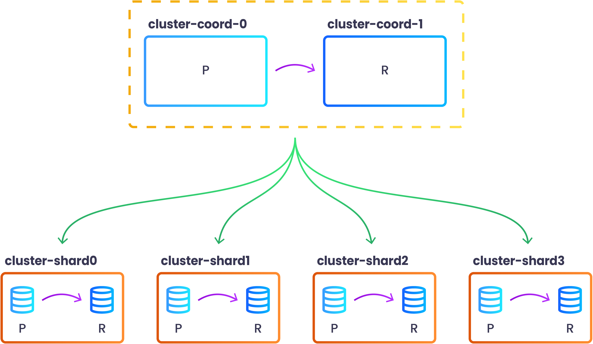

## What is a Sharded Cluster

A sharded cluster is a cluster that implements database sharding. Database sharding is the process of storing a large database across multiple machines. This is achieved by separating table rows
 among multiple Postgres primary instances. This approach gives the ability to scale out a database into multiple instances allowing to benefit both reads and writes throughput but also to separate
 data among different instances for security and/or to address regulatory or compliance requirements.

## How is Sharded Cluster implemented

A sharded cluster is implemented by creting an SGCluster called coordinator and one or more SGCluster called shards. The coordinator, as the name implies, coordinates the shards where the data is
 actually stored. StackGres takes care of creating the dependent SGCluster by following the specification set in the SGShardedCluster.

The SGShardedCluster can define the type of sharding (that is the internal sharding implementation used) and the database to be sharded.

Currently only one implementation is available and this is provided by using [Citus](https://github.com/citusdata/citus) extension.

## Creating a basic Citus Sharded Cluster

Create the SGShardedCluster resource:

```yaml
cat << EOF | kubectl apply -f -
apiVersion: stackgres.io/v1alpha1
kind: SGShardedCluster
metadata:
  name: cluster
spec:
  type: citus
  database: mydatabase
  postgres:
    version: '15'
  coordinator:
    instances: 2
    pods:
      persistentVolume:
        size: '10Gi'
  shards:
    clusters: 4
    instancesPerCluster: 2
    pods:
      persistentVolume:
        size: '10Gi'
EOF
```

This configuration will create a coordinator with 2 Pods and 4 shards with 2 Pods each.

By default the coordintor node has a synchronous replica to avoid losing any metadata that could break the sharded cluster.

The shards are where sharded data lives and have a replica in order to provide high availability to the cluster.



After all the Pods are Ready you can view the topology of the newly created sharded cluster by issuing the following command:

```
kubectl exec -n my-cluster cluster-coord-0 -c patroni -- patronictl list
+ Citus cluster: cluster --+------------------+--------------+---------+----+-----------+
| Group | Member           | Host             | Role         | State   | TL | Lag in MB |
+-------+------------------+------------------+--------------+---------+----+-----------+
|     0 | cluster-coord-0  | 10.244.0.16:7433 | Leader       | running |  1 |           |
|     0 | cluster-coord-1  | 10.244.0.34:7433 | Sync Standby | running |  1 |         0 |
|     1 | cluster-shard0-0 | 10.244.0.19:7433 | Leader       | running |  1 |           |
|     1 | cluster-shard0-1 | 10.244.0.48:7433 | Replica      | running |  1 |         0 |
|     2 | cluster-shard1-0 | 10.244.0.20:7433 | Leader       | running |  1 |           |
|     2 | cluster-shard1-1 | 10.244.0.42:7433 | Replica      | running |  1 |         0 |
|     3 | cluster-shard2-0 | 10.244.0.22:7433 | Leader       | running |  1 |           |
|     3 | cluster-shard2-1 | 10.244.0.43:7433 | Replica      | running |  1 |         0 |
|     4 | cluster-shard3-0 | 10.244.0.27:7433 | Leader       | running |  1 |           |
|     4 | cluster-shard3-1 | 10.244.0.45:7433 | Replica      | running |  1 |         0 |
+-------+------------------+------------------+--------------+---------+----+-----------+
```

You may also check that they are already configured in Citus by running the following command:

```
$ kubectl exec -n my-cluster cluster-coord-0 -c patroni -- psql -d mydatabase -c 'SELECT * FROM pg_dist_node'
 nodeid | groupid |  nodename   | nodeport | noderack | hasmetadata | isactive | noderole | nodecluster | metadatasynced | shouldhaveshards 
--------+---------+-------------+----------+----------+-------------+----------+----------+-------------+----------------+------------------
      1 |       0 | 10.244.0.34 |     7433 | default  | t           | t        | primary  | default     | t              | f
      3 |       2 | 10.244.0.20 |     7433 | default  | t           | t        | primary  | default     | t              | t
      2 |       1 | 10.244.0.19 |     7433 | default  | t           | t        | primary  | default     | t              | t
      4 |       3 | 10.244.0.22 |     7433 | default  | t           | t        | primary  | default     | t              | t
      5 |       4 | 10.244.0.27 |     7433 | default  | t           | t        | primary  | default     | t              | t
(5 rows)
```

Please, take into account that the `groupid` column of the `pg_dist_node` table is the same as the Patroni Group column above. In particular, the group with identifier 0 is the coordinator group (coordinator have `shouldhaveshards` column set to `f`).

For a more complete configuration please have a look at [Create Citus Sharded Cluster Section]({}).