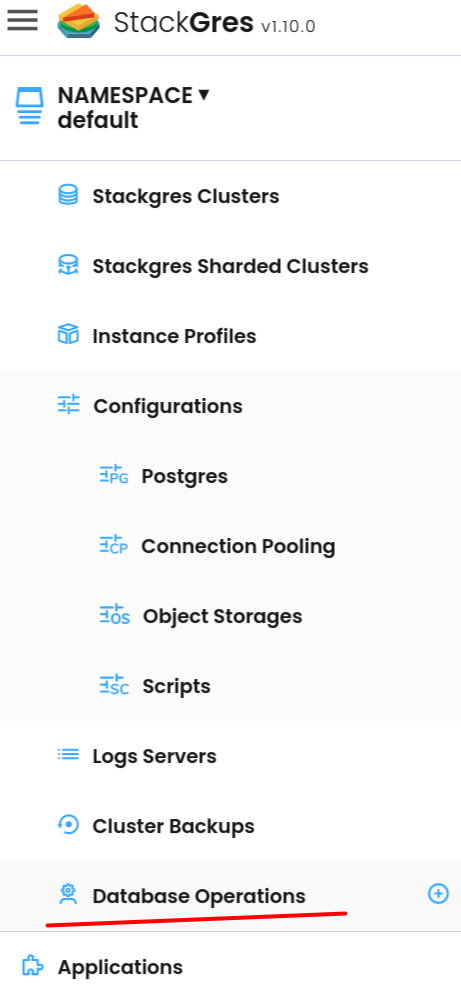

Performing a minor version upgrade is a simple process, this type of upgrade only requires to upgrade the executable files (binaries) while the server is down. Once the files where replaced the server must be restarted. 

Minor releases never change the internal storage format and are always compatible with earlier and later minor releases of the same major version number. For example, version 10.1 is compatible with version 10.0 and version 10.6. Similarly. [Check Official Postgres documentation](https://www.postgresql.org/docs/current/upgrading.html).

StackGres simplify the process to perform a minor version upgrade providing two different methods to accomplish this, using the Web Console or by the `kubectl`  CLI. 


## Minor version upgrade using the Web Console

StackGres already provides a `Database Operation` called `Minor Version Upgrade`

- Go to `Database Operations` 



- Click over the Plus (+) button 

- Then the `Create Database Operation` page will be open. 


- Choose your target cluster

- You can set the process to be executed at a specific time, if not set the process will be executed immediately.

- If required you can add the Node Tolerations.

- Choose the method:
  - **In place:** The in-place method does not require more resources than those that are available. In case only an instance of the StackGres cluster is
    present this mean the service disruption will last longer so we encourage use the reduced impact restart and especially for a production environment.
  - **Reduce impact:** this procedure is the same as the in-place method but require additional resources in order to spawn a new updated replica that
    will be removed when the procedure completes.  

- Finally click on `Create Operation`

### Process Detail

All the operations executed to perform the minor version upgrade will be shown in the `Database Operation` detail. 


## Minor version upgrade using the kubectl CLI

In order to execute the process by using the CLI, you need to create the SGDbOps manifest. In the next example a minor version upgrade from Postgres version `16.1` to `16.2` will be performed:

To execute the process create and apply the manifest with the next command:  

```yaml
cat << EOF | kubectl apply -f -
apiVersion: stackgres.io/v1
kind: SGDbOps
metadata:
  name: minor-v-upgrade
  namespace: default
spec:
  minorVersionUpgrade:
    method: InPlace
    postgresVersion: "16.2"
  op: minorVersionUpgrade
  sgCluster: demo
EOF
```

Check each specific parameter on the manifest, they are all the same that you can specify when using the Web Console. 

- **op:** Is the operation to be executed
- **sgCluster:** The target cluster name to be upgraded
- **minorVersionUpgrade:**
  - **method:** InPlace or Reduce impact
  - **postgresVersion:** Target postgres version.

Once you apply the manifest you can check the operation status with: 

```bash
❯ kubectl get sgdbops.stackgres.io minor-v-upgrade

NAME              CLUSTER   OPERATION             STATUS
minor-v-upgrade   demo      minorVersionUpgrade   OperationRunning
```

You can check the operation log by checking the pods logs: 

```bash
❯ kubectl logs minor-v-upgrade-g7jf8 
```

output ommited for presentation purpose.