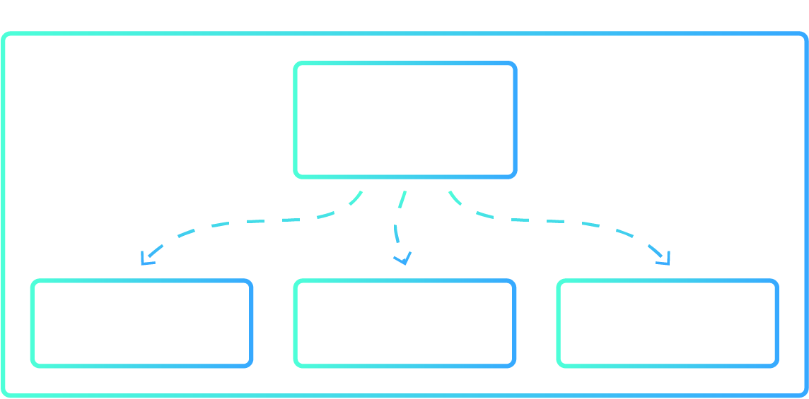

Once you hace a StackGres cluster installed you'll have a Full HA PostgreSQL configuration and depending of the size of your cluster you´ll have something like this:




These represents the containers of the StackGres cluster and you can list them using `kubectl` command like:

```bash
kubectl get pods -n default -l app=StackGresCluster,stackgres.io/cluster=true
````

> **Note:** Change `-n` param to point to your namespace, in this example we use default.

And we'll get an output like:

```bash
NAME          READY   STATUS    RESTARTS   AGE
stackgres-0   5/5     Running   0          163m
stackgres-1   5/5     Running   0          163m
stackgres-2   5/5     Running   0          162m
```

## Identifying the master and replica nodes

One of the most important task is to be able to identify which node is the current master and which ones the replica nodes.

We have two differents ways to acomplish this. The first one is with the `kubectl` command using the pod labels:

To identify the master node:

```bash
kubectl get pods -n default -l app=StackGresCluster -l role=master
```

output:

```bash
NAME          READY   STATUS    RESTARTS   AGE
stackgres-0   5/5     Running   0          165m
```

To identify the replica nodes:

```
kubectl get pods -n default -l app=StackGresCluster,stackgres.io/cluster=true -l role=replica
```

output:

```
NAME          READY   STATUS    RESTARTS   AGE
stackgres-1   5/5     Running   0          165m
stackgres-2   5/5     Running   0          165m
```

The other way is to use the own patroni commands. But first we need to connect to the patroni container:

```bash
kubectl exec -it stackgres-0 -c patroni -- bash
```

Once you are connected to it run the patroni command:

```bash
patronictl list
```

That will result:

```bash
+-----------+-------------+------------------+--------+---------+----+-----------+
|  Cluster  |    Member   |       Host       |  Role  |  State  | TL | Lag in MB |
+-----------+-------------+------------------+--------+---------+----+-----------+
| stackgres | stackgres-0 | 10.244.0.11:5433 | Leader | running |  2 |           |
| stackgres | stackgres-1 | 10.244.0.12:5433 |        | running |  2 |       0.0 |
| stackgres | stackgres-2 | 10.244.0.13:5433 |        | running |  2 |       0.0 |
+-----------+-------------+------------------+--------+---------+----+-----------+
```

As you can see we get the cluster status from patroni node. We can appreciate some value information here:

- Who is the master node
- Who are the replica nodes
- The ip and port
- The State of each node
- The Lag in MB in case some of the node is not up to date.


## How to perform a Switchover to a replica

A switchover (or graceful switchover) is a planned role reversal between the primary and the one of the standby databases.
This is used when there is a planned outage on the primary database or primary server and you do not want to have extended downtime on the primary database.
The switchover allows you to switch the roles of the databases so that the standby databases now becomes a primary databases and all your users and applications can continue operations on the "new" primary node.


To perform this we will use the `patronictl switchover` command:

As we can see in the cluster status shown before the master node is the one called `stackgres-0` with the leader role and we going to switch it to the node called `stackgres-1` so we run:

```
bash-4.4$ patronictl switchover
```

Then we will be asked for the master node (note that the command already give us the master node name):

```
Master [stackgres-0]:
```

then we will be asked for the cantidate we want to promote:

```
Candidate ['stackgres-1', 'stackgres-2'] []:
```

and when we want to make the change:

```
When should the switchover take place (e.g. 2020-01-16T17:23 )  [now]:
```

And as a final question and warning, this show us the current status and if we want to proceed with the change:

```
Current cluster topology
+-----------+-------------+------------------+--------+---------+----+-----------+
|  Cluster  |    Member   |       Host       |  Role  |  State  | TL | Lag in MB |
+-----------+-------------+------------------+--------+---------+----+-----------+
| stackgres | stackgres-0 | 10.244.0.11:5433 | Leader | running |  2 |           |
| stackgres | stackgres-1 | 10.244.0.12:5433 |        | running |  2 |       0.0 |
| stackgres | stackgres-2 | 10.244.0.13:5433 |        | running |  2 |       0.0 |
+-----------+-------------+------------------+--------+---------+----+-----------+
Are you sure you want to switchover cluster stackgres, demoting current master stackgres-0? [y/N]:
```

After accept the change patroni will output the operation status and the new cluster status:

```
2020-01-16 16:26:13.03648 Successfully switched over to "stackgres-1"
+-----------+-------------+------------------+--------+---------+----+-----------+
|  Cluster  |    Member   |       Host       |  Role  |  State  | TL | Lag in MB |
+-----------+-------------+------------------+--------+---------+----+-----------+
| stackgres | stackgres-0 | 10.244.0.11:5433 |        | stopped |    |   unknown |
| stackgres | stackgres-1 | 10.244.0.12:5433 | Leader | running |  3 |           |
| stackgres | stackgres-2 | 10.244.0.13:5433 |        | running |    |   unknown |
+-----------+-------------+------------------+--------+---------+----+-----------+
```

The old master node `stackgres-0` will be stopped and then re-joined to the cluster as a replica.

```
bash-4.4$ patronictl list
+-----------+-------------+------------------+--------+---------+----+-----------+
|  Cluster  |    Member   |       Host       |  Role  |  State  | TL | Lag in MB |
+-----------+-------------+------------------+--------+---------+----+-----------+
| stackgres | stackgres-0 | 10.244.0.11:5433 |        | running |  3 |       0.0 |
| stackgres | stackgres-1 | 10.244.0.12:5433 | Leader | running |  3 |           |
| stackgres | stackgres-2 | 10.244.0.13:5433 |        | running |  3 |       0.0 |
+-----------+-------------+------------------+--------+---------+----+-----------+
```

**Important note:** We strongly recommend to not manipulate the cluster with any other `patronictl` to avoid data lost or damage the entire configuration. Use de command explained above only if you know what are you doing.
