```mermaid
flowchart TD
  v1_4_3["1.4.3"]
  v1_5_0["1.5.0"]
  v1_6_0_rc1["1.6.0-rc1"]
  v1_6_0_rc2["1.6.0-rc2"]
  v1_6_1["1.6.1"]
  v1_7_0["1.7.0"]
  v1_8_0["1.8.0"]
  v1_8_1["1.8.1"]
  v1_9_0["1.9.0"]
  v1_10_0["1.10.0"]
  v1_11_0["1.11.0"]
  v1_12_0["1.12.0"]
  v1_13_0["1.13.0"]
  v1_14_0["1.14.0"]
  v1_14_1["1.14.1"]
  v1_14_2["1.14.2"]
  v1_14_3["1.14.3"]
  v1_15_0["1.15.0"]
  v1_15_1["1.15.1"]
  v1_15_2["1.15.2"]
  v1_16_0["1.16.0"]
  v1_16_1["1.16.1"]
  v1_16_2["1.16.2"]
  v1_16_3["1.16.3"]
  v1_17_0["1.17.0"]
  v1_17_1["1.17.1"]
  v1_17_2["1.17.2"]
  v1_17_3["1.17.3"]
  v1_17_4["1.17.4"]
  v1_18_0["1.18.0"]
  v1_18_1["1.18.1"]
  v1_18_2["1.18.2"]
  v1_18_3["1.18.3"]
  v1_18_4["1.18.4"]
  v1_18_5["1.18.5"]
  v1_18_6["1.18.6"]
  v1_18_7["1.18.7"]
  v1_18_8["1.18.8"]
  v1_18_9["1.18.9"]
  v1_19_1["1.19.1"]
  v1_19_2["1.19.2"]:::head
  v1_4_3 --> v1_5_0
  v1_5_0 --> v1_6_0_rc1
  v1_6_0_rc1 --> v1_6_0_rc2
  v1_6_0_rc2 --> v1_6_1
  v1_6_1 --> v1_7_0
  v1_7_0 --> v1_8_0
  v1_8_0 --> v1_8_1
  v1_8_1 --> v1_9_0
  v1_9_0 --> v1_10_0
  v1_10_0 --> v1_11_0
  v1_11_0 --> v1_12_0
  v1_12_0 --> v1_13_0
  v1_13_0 --> v1_14_0
  v1_14_0 --> v1_14_1
  v1_14_1 --> v1_14_2
  v1_14_2 --> v1_14_3
  v1_14_3 --> v1_15_0
  v1_15_0 --> v1_15_1
  v1_15_1 --> v1_15_2
  v1_15_2 --> v1_16_0
  v1_16_0 --> v1_16_1
  v1_16_1 --> v1_16_2
  v1_16_2 --> v1_16_3
  v1_16_3 --> v1_17_0
  v1_17_0 --> v1_17_1
  v1_17_1 --> v1_17_2
  v1_17_2 --> v1_17_3
  v1_17_3 --> v1_17_4
  v1_17_4 --> v1_18_0
  v1_18_0 --> v1_18_1
  v1_18_1 --> v1_18_2
  v1_18_2 --> v1_18_3
  v1_18_3 --> v1_18_4
  v1_18_4 --> v1_18_5
  v1_18_5 --> v1_18_6
  v1_18_6 --> v1_18_7
  v1_18_7 --> v1_18_8
  v1_18_8 --> v1_18_9
  v1_18_9 --> v1_19_1
  v1_19_1 --> v1_19_2
  classDef head stroke-width:3px
  classDef removed stroke-dasharray:4 4,color:#888
```

# OperatorHub versions

Update graph of each channel of operator `stackgres` in [OperatorHub](https://github.com/k8s-operatorhub/community-operators),
generated by `versions-of-operatorhub.sh` from the bundles in `operators/stackgres` (update graph `semver-mode`) at commit
`37eca37d1 (2026-10-06)`.

Default channel: `stable`

A solid arrow goes from a version to the one that replaces it, a dotted arrow from a
version to one that skips it. The heads of a channel have a thick border, and versions
that are only skipped, since they are no longer in the catalog, a dashed one.

## Channel `candidate`

Head: `1.19.2`

```mermaid
flowchart TD
  v1_6_1["1.6.1"]
  v1_7_0_rc1["1.7.0-rc1"]
  v1_7_0["1.7.0"]
  v1_8_0["1.8.0"]
  v1_8_1["1.8.1"]
  v1_9_0_rc1["1.9.0-rc1"]
  v1_9_0["1.9.0"]
  v1_10_0_rc1["1.10.0-rc1"]
  v1_10_0["1.10.0"]
  v1_11_0_rc1["1.11.0-rc1"]
  v1_11_0["1.11.0"]
  v1_12_0_rc1["1.12.0-rc1"]
  v1_12_0["1.12.0"]
  v1_13_0_rc1["1.13.0-rc1"]
  v1_13_0["1.13.0"]
  v1_14_0_rc1["1.14.0-rc1"]
  v1_14_0_rc2["1.14.0-rc2"]
  v1_14_0["1.14.0"]
  v1_14_1["1.14.1"]
  v1_14_2["1.14.2"]
  v1_14_3["1.14.3"]
  v1_15_0_rc1["1.15.0-rc1"]
  v1_15_0_rc2["1.15.0-rc2"]
  v1_15_0_rc3["1.15.0-rc3"]
  v1_15_0_rc4["1.15.0-rc4"]
  v1_15_0["1.15.0"]
  v1_15_1["1.15.1"]
  v1_15_2["1.15.2"]
  v1_16_0_rc1["1.16.0-rc1"]
  v1_16_0_rc2["1.16.0-rc2"]
  v1_16_0_rc3["1.16.0-rc3"]
  v1_16_0["1.16.0"]
  v1_16_1["1.16.1"]
  v1_16_2["1.16.2"]
  v1_16_3["1.16.3"]
  v1_17_0_rc1["1.17.0-rc1"]
  v1_17_0["1.17.0"]
  v1_17_1["1.17.1"]
  v1_17_2["1.17.2"]
  v1_17_3["1.17.3"]
  v1_17_4["1.17.4"]
  v1_18_0_rc1["1.18.0-rc1"]
  v1_18_0_rc2["1.18.0-rc2"]
  v1_18_0_rc3["1.18.0-rc3"]
  v1_18_0_rc4["1.18.0-rc4"]
  v1_18_0["1.18.0"]
  v1_18_1["1.18.1"]
  v1_18_2["1.18.2"]
  v1_18_3["1.18.3"]
  v1_18_4["1.18.4"]
  v1_18_5["1.18.5"]
  v1_18_6["1.18.6"]
  v1_18_7["1.18.7"]
  v1_18_8["1.18.8"]
  v1_18_9["1.18.9"]
  v1_19_0_rc1["1.19.0-rc1"]
  v1_19_0_rc2["1.19.0-rc2"]
  v1_19_0_rc3["1.19.0-rc3"]
  v1_19_0_rc4["1.19.0-rc4"]
  v1_19_1["1.19.1"]
  v1_19_2["1.19.2"]:::head
  v1_6_1 --> v1_7_0_rc1
  v1_7_0_rc1 --> v1_7_0
  v1_7_0 --> v1_8_0
  v1_8_0 --> v1_8_1
  v1_8_1 --> v1_9_0_rc1
  v1_9_0_rc1 --> v1_9_0
  v1_9_0 --> v1_10_0_rc1
  v1_10_0_rc1 --> v1_10_0
  v1_10_0 --> v1_11_0_rc1
  v1_11_0_rc1 --> v1_11_0
  v1_11_0 --> v1_12_0_rc1
  v1_12_0_rc1 --> v1_12_0
  v1_12_0 --> v1_13_0_rc1
  v1_13_0_rc1 --> v1_13_0
  v1_13_0 --> v1_14_0_rc1
  v1_14_0_rc1 --> v1_14_0_rc2
  v1_14_0_rc2 --> v1_14_0
  v1_14_0 --> v1_14_1
  v1_14_1 --> v1_14_2
  v1_14_2 --> v1_14_3
  v1_14_3 --> v1_15_0_rc1
  v1_15_0_rc1 --> v1_15_0_rc2
  v1_15_0_rc2 --> v1_15_0_rc3
  v1_15_0_rc3 --> v1_15_0_rc4
  v1_15_0_rc4 --> v1_15_0
  v1_15_0 --> v1_15_1
  v1_15_1 --> v1_15_2
  v1_15_2 --> v1_16_0_rc1
  v1_16_0_rc1 --> v1_16_0_rc2
  v1_16_0_rc2 --> v1_16_0_rc3
  v1_16_0_rc3 --> v1_16_0
  v1_16_0 --> v1_16_1
  v1_16_1 --> v1_16_2
  v1_16_2 --> v1_16_3
  v1_16_3 --> v1_17_0_rc1
  v1_17_0_rc1 --> v1_17_0
  v1_17_0 --> v1_17_1
  v1_17_1 --> v1_17_2
  v1_17_2 --> v1_17_3
  v1_17_3 --> v1_17_4
  v1_17_4 --> v1_18_0_rc1
  v1_18_0_rc1 --> v1_18_0_rc2
  v1_18_0_rc2 --> v1_18_0_rc3
  v1_18_0_rc3 --> v1_18_0_rc4
  v1_18_0_rc4 --> v1_18_0
  v1_18_0 --> v1_18_1
  v1_18_1 --> v1_18_2
  v1_18_2 --> v1_18_3
  v1_18_3 --> v1_18_4
  v1_18_4 --> v1_18_5
  v1_18_5 --> v1_18_6
  v1_18_6 --> v1_18_7
  v1_18_7 --> v1_18_8
  v1_18_8 --> v1_18_9
  v1_18_9 --> v1_19_0_rc1
  v1_19_0_rc1 --> v1_19_0_rc2
  v1_19_0_rc2 --> v1_19_0_rc3
  v1_19_0_rc3 --> v1_19_0_rc4
  v1_19_0_rc4 --> v1_19_1
  v1_19_1 --> v1_19_2
  classDef head stroke-width:3px
  classDef removed stroke-dasharray:4 4,color:#888
```

## Channel `fast`

Head: `1.19.2`

## Channel `stable`

Head: `1.19.2`

