```mermaid
flowchart TD
  v1_11_0["1.11.0<br/>v4.12-v4.15"]
  v1_12_0["1.12.0<br/>v4.12-v4.16"]
  v1_13_0["1.13.0<br/>v4.12-v4.16"]
  v1_14_0["1.14.0<br/>v4.17"]
  v1_14_1["1.14.1<br/>v4.17"]
  v1_14_2["1.14.2<br/>v4.17"]
  v1_14_3["1.14.3<br/>v4.12-v4.17"]
  v1_15_0["1.15.0<br/>v4.17"]
  v1_15_1["1.15.1<br/>v4.17"]
  v1_15_2["1.15.2<br/>v4.12-v4.17"]
  v1_16_0["1.16.0<br/>v4.17"]
  v1_16_1["1.16.1<br/>v4.17"]
  v1_16_2["1.16.2<br/>v4.17"]
  v1_16_3["1.16.3<br/>v4.12-v4.17"]
  v1_17_0["1.17.0<br/>v4.17-v4.19"]
  v1_17_1["1.17.1<br/>v4.17-v4.19"]
  v1_17_2["1.17.2<br/>v4.17-v4.19"]
  v1_17_3["1.17.3<br/>v4.17-v4.19"]
  v1_17_4["1.17.4<br/>v4.12-v4.19"]
  v1_18_0["1.18.0<br/>v4.17-v4.19"]
  v1_18_1["1.18.1<br/>v4.17-v4.20"]
  v1_18_2["1.18.2<br/>v4.17-v4.20"]
  v1_18_3["1.18.3<br/>v4.17-v4.20"]
  v1_18_4["1.18.4<br/>v4.17-v4.20"]
  v1_18_5["1.18.5<br/>v4.17-v4.20"]
  v1_18_6["1.18.6<br/>v4.17-v4.20"]
  v1_18_7["1.18.7<br/>v4.17-v4.21"]
  v1_18_8["1.18.8"]
  v1_19_0["1.19.0"]
  v1_19_1["1.19.1"]:::head
  v1_11_0 --> |"v4.12-v4.15"| v1_12_0
  v1_12_0 --> |"v4.12-v4.16"| v1_13_0
  v1_14_0 --> |"v4.17"| v1_14_1
  v1_14_1 --> |"v4.17"| v1_14_2
  v1_13_0 --> |"v4.12-v4.16"| v1_14_3
  v1_14_0 -.-> |"v4.12-v4.16"| v1_14_3
  v1_14_1 -.-> |"v4.12-v4.16"| v1_14_3
  v1_14_2 --> |"v4.17"| v1_14_3
  v1_14_2 -.-> |"v4.12-v4.16"| v1_14_3
  v1_14_3 --> |"v4.17"| v1_15_0
  v1_15_0 --> |"v4.17"| v1_15_1
  v1_14_3 --> |"v4.12-v4.16"| v1_15_2
  v1_15_0 -.-> |"v4.12-v4.16"| v1_15_2
  v1_15_1 --> |"v4.17"| v1_15_2
  v1_15_1 -.-> |"v4.12-v4.16"| v1_15_2
  v1_15_2 --> |"v4.17"| v1_16_0
  v1_16_0 --> |"v4.17"| v1_16_1
  v1_16_1 --> |"v4.17"| v1_16_2
  v1_15_2 --> |"v4.12-v4.16"| v1_16_3
  v1_16_0 -.-> |"v4.12-v4.16"| v1_16_3
  v1_16_1 -.-> |"v4.12-v4.16"| v1_16_3
  v1_16_2 --> |"v4.17"| v1_16_3
  v1_16_2 -.-> |"v4.12-v4.16"| v1_16_3
  v1_16_3 --> |"v4.17"| v1_17_0
  v1_17_0 --> |"v4.17-v4.19"| v1_17_1
  v1_17_1 --> |"v4.17-v4.19"| v1_17_2
  v1_17_2 --> |"v4.17-v4.19"| v1_17_3
  v1_16_3 --> |"v4.12-v4.16"| v1_17_4
  v1_17_0 -.-> |"v4.12-v4.16"| v1_17_4
  v1_17_1 -.-> |"v4.12-v4.16"| v1_17_4
  v1_17_2 -.-> |"v4.12-v4.16"| v1_17_4
  v1_17_3 --> |"v4.17-v4.19"| v1_17_4
  v1_17_3 -.-> |"v4.12-v4.16"| v1_17_4
  v1_17_4 --> |"v4.17-v4.19"| v1_18_0
  v1_18_0 --> |"v4.17-v4.19"| v1_18_1
  v1_18_1 --> |"v4.17-v4.20"| v1_18_2
  v1_18_2 --> |"v4.17-v4.20"| v1_18_3
  v1_18_3 --> |"v4.17-v4.20"| v1_18_4
  v1_18_4 --> |"v4.17-v4.20"| v1_18_5
  v1_18_5 --> |"v4.17-v4.20"| v1_18_6
  v1_18_6 --> |"v4.17-v4.20"| v1_18_7
  v1_17_4 --> |"v4.12-v4.16"| v1_18_8
  v1_18_0 -.-> |"v4.12-v4.16"| v1_18_8
  v1_18_1 -.-> |"v4.12-v4.16"| v1_18_8
  v1_18_2 -.-> |"v4.12-v4.16"| v1_18_8
  v1_18_3 -.-> |"v4.12-v4.16"| v1_18_8
  v1_18_4 -.-> |"v4.12-v4.16"| v1_18_8
  v1_18_5 -.-> |"v4.12-v4.16"| v1_18_8
  v1_18_6 -.-> |"v4.12-v4.16"| v1_18_8
  v1_18_7 --> |"v4.17-v4.21"| v1_18_8
  v1_18_7 -.-> |"v4.12-v4.16"| v1_18_8
  v1_18_8 --> v1_19_0
  v1_19_0 --> v1_19_1
  classDef head stroke-width:3px
  classDef removed stroke-dasharray:4 4,color:#888
```

# Red Hat Community versions

Update graph of each channel of operator `stackgres-community` in [Red Hat Community](https://github.com/redhat-openshift-ecosystem/community-operators-prod),
generated by `versions-of-red-hat-community.sh` from the file-based catalog templates in `operators/stackgres-community/catalog-templates` at commit
`9344bd13b (2026-10-06)`.

Default channel: `stable`

A solid arrow goes from a version to the one that replaces it, a dotted arrow from a
version to one that skips it. The heads of a channel have a thick border, and versions
that are only skipped, since they are no longer in the catalog, a dashed one.
A version or an arrow that is not in every OCP catalog is labeled with the catalogs it is in.

## Channel `candidate`

Head: `1.19.1`

```mermaid
flowchart TD
  v1_11_0["1.11.0<br/>v4.12-v4.15"]
  v1_12_0_rc1["1.12.0-rc1"]:::removed
  v1_12_0["1.12.0<br/>v4.12-v4.16"]
  v1_13_0_rc1["1.13.0-rc1"]:::removed
  v1_13_0["1.13.0<br/>v4.12-v4.16"]
  v1_14_0_rc1["1.14.0-rc1<br/>v4.17"]
  v1_14_0_rc2["1.14.0-rc2<br/>v4.17"]
  v1_14_0["1.14.0<br/>v4.17"]
  v1_14_1["1.14.1<br/>v4.17"]
  v1_14_2["1.14.2<br/>v4.17"]
  v1_14_3["1.14.3<br/>v4.12-v4.17"]
  v1_15_0_rc1["1.15.0-rc1<br/>v4.17"]
  v1_15_0_rc2["1.15.0-rc2<br/>v4.17"]
  v1_15_0_rc3["1.15.0-rc3<br/>v4.17"]
  v1_15_0_rc4["1.15.0-rc4<br/>v4.17"]
  v1_15_0["1.15.0<br/>v4.17"]
  v1_15_1["1.15.1<br/>v4.17"]
  v1_15_2["1.15.2<br/>v4.12-v4.17"]
  v1_16_0_rc1["1.16.0-rc1<br/>v4.17"]
  v1_16_0_rc2["1.16.0-rc2<br/>v4.17"]
  v1_16_0_rc3["1.16.0-rc3<br/>v4.17"]
  v1_16_0["1.16.0<br/>v4.17"]
  v1_16_1["1.16.1<br/>v4.17"]
  v1_16_2["1.16.2<br/>v4.17"]
  v1_16_3["1.16.3<br/>v4.12-v4.17"]
  v1_17_0_rc1["1.17.0-rc1<br/>v4.17-v4.19"]
  v1_17_0["1.17.0<br/>v4.17-v4.19"]
  v1_17_1["1.17.1<br/>v4.17-v4.19"]
  v1_17_2["1.17.2<br/>v4.17-v4.19"]
  v1_17_3["1.17.3<br/>v4.17-v4.19"]
  v1_17_4["1.17.4<br/>v4.12-v4.19"]
  v1_18_0_rc1["1.18.0-rc1<br/>v4.17-v4.19"]
  v1_18_0_rc2["1.18.0-rc2<br/>v4.17-v4.19"]
  v1_18_0_rc3["1.18.0-rc3<br/>v4.17-v4.19"]
  v1_18_0_rc4["1.18.0-rc4<br/>v4.17-v4.19"]
  v1_18_0["1.18.0<br/>v4.17-v4.19"]
  v1_18_1["1.18.1<br/>v4.17-v4.20"]
  v1_18_2["1.18.2<br/>v4.17-v4.20"]
  v1_18_3["1.18.3<br/>v4.17-v4.20"]
  v1_18_4["1.18.4<br/>v4.17-v4.20"]
  v1_18_5["1.18.5<br/>v4.17-v4.20"]
  v1_18_6["1.18.6<br/>v4.17-v4.20"]
  v1_18_7["1.18.7<br/>v4.17-v4.21"]
  v1_18_8["1.18.8"]
  v1_19_0_rc1["1.19.0-rc1"]
  v1_19_0_rc2["1.19.0-rc2"]
  v1_19_0_rc3["1.19.0-rc3"]
  v1_19_0_rc4["1.19.0-rc4"]
  v1_19_0_rc5["1.19.0-rc5"]
  v1_19_0["1.19.0"]
  v1_19_1["1.19.1"]:::head
  v1_11_0 --> |"v4.12-v4.15"| v1_12_0
  v1_12_0_rc1 -.-> |"v4.12-v4.16"| v1_12_0
  v1_12_0 --> |"v4.12-v4.16"| v1_13_0
  v1_13_0_rc1 -.-> |"v4.12-v4.16"| v1_13_0
  v1_14_0_rc1 --> |"v4.17"| v1_14_0_rc2
  v1_14_0_rc2 --> |"v4.17"| v1_14_0
  v1_14_0 --> |"v4.17"| v1_14_1
  v1_14_1 --> |"v4.17"| v1_14_2
  v1_13_0 --> |"v4.12-v4.16"| v1_14_3
  v1_14_0_rc1 -.-> |"v4.12-v4.16"| v1_14_3
  v1_14_0_rc2 -.-> |"v4.12-v4.16"| v1_14_3
  v1_14_0 -.-> |"v4.12-v4.16"| v1_14_3
  v1_14_1 -.-> |"v4.12-v4.16"| v1_14_3
  v1_14_2 --> |"v4.17"| v1_14_3
  v1_14_2 -.-> |"v4.12-v4.16"| v1_14_3
  v1_14_3 --> |"v4.17"| v1_15_0_rc1
  v1_15_0_rc1 --> |"v4.17"| v1_15_0_rc2
  v1_15_0_rc2 --> |"v4.17"| v1_15_0_rc3
  v1_15_0_rc3 --> |"v4.17"| v1_15_0_rc4
  v1_15_0_rc4 --> |"v4.17"| v1_15_0
  v1_15_0 --> |"v4.17"| v1_15_1
  v1_14_3 --> |"v4.12-v4.16"| v1_15_2
  v1_15_0_rc1 -.-> |"v4.12-v4.16"| v1_15_2
  v1_15_0_rc2 -.-> |"v4.12-v4.16"| v1_15_2
  v1_15_0_rc3 -.-> |"v4.12-v4.16"| v1_15_2
  v1_15_0_rc4 -.-> |"v4.12-v4.16"| v1_15_2
  v1_15_0 -.-> |"v4.12-v4.16"| v1_15_2
  v1_15_1 --> |"v4.17"| v1_15_2
  v1_15_1 -.-> |"v4.12-v4.16"| v1_15_2
  v1_15_2 --> |"v4.17"| v1_16_0_rc1
  v1_16_0_rc1 --> |"v4.17"| v1_16_0_rc2
  v1_16_0_rc2 --> |"v4.17"| v1_16_0_rc3
  v1_16_0_rc3 --> |"v4.17"| v1_16_0
  v1_16_0 --> |"v4.17"| v1_16_1
  v1_16_1 --> |"v4.17"| v1_16_2
  v1_15_2 --> |"v4.12-v4.16"| v1_16_3
  v1_16_0_rc1 -.-> |"v4.12-v4.16"| v1_16_3
  v1_16_0_rc2 -.-> |"v4.12-v4.16"| v1_16_3
  v1_16_0_rc3 -.-> |"v4.12-v4.16"| v1_16_3
  v1_16_0 -.-> |"v4.12-v4.16"| v1_16_3
  v1_16_1 -.-> |"v4.12-v4.16"| v1_16_3
  v1_16_2 --> |"v4.17"| v1_16_3
  v1_16_2 -.-> |"v4.12-v4.16"| v1_16_3
  v1_16_3 --> |"v4.17"| v1_17_0_rc1
  v1_17_0_rc1 --> |"v4.17-v4.19"| v1_17_0
  v1_17_0 --> |"v4.17-v4.19"| v1_17_1
  v1_17_1 --> |"v4.17-v4.19"| v1_17_2
  v1_17_2 --> |"v4.17-v4.19"| v1_17_3
  v1_16_3 --> |"v4.12-v4.16"| v1_17_4
  v1_17_0_rc1 -.-> |"v4.12-v4.16"| v1_17_4
  v1_17_0 -.-> |"v4.12-v4.16"| v1_17_4
  v1_17_1 -.-> |"v4.12-v4.16"| v1_17_4
  v1_17_2 -.-> |"v4.12-v4.16"| v1_17_4
  v1_17_3 --> |"v4.17-v4.19"| v1_17_4
  v1_17_3 -.-> |"v4.12-v4.16"| v1_17_4
  v1_17_4 --> |"v4.17-v4.19"| v1_18_0_rc1
  v1_18_0_rc1 --> |"v4.17-v4.19"| v1_18_0_rc2
  v1_18_0_rc2 --> |"v4.17-v4.19"| v1_18_0_rc3
  v1_18_0_rc3 --> |"v4.17-v4.19"| v1_18_0_rc4
  v1_18_0_rc4 --> |"v4.17-v4.19"| v1_18_0
  v1_18_0 --> |"v4.17-v4.19"| v1_18_1
  v1_18_1 --> |"v4.17-v4.20"| v1_18_2
  v1_18_2 --> |"v4.17-v4.20"| v1_18_3
  v1_18_3 --> |"v4.17-v4.20"| v1_18_4
  v1_18_4 --> |"v4.17-v4.20"| v1_18_5
  v1_18_5 --> |"v4.17-v4.20"| v1_18_6
  v1_18_6 --> |"v4.17-v4.20"| v1_18_7
  v1_17_4 --> |"v4.12-v4.16"| v1_18_8
  v1_18_0_rc1 -.-> |"v4.12-v4.16"| v1_18_8
  v1_18_0_rc2 -.-> |"v4.12-v4.16"| v1_18_8
  v1_18_0_rc3 -.-> |"v4.12-v4.16"| v1_18_8
  v1_18_0_rc4 -.-> |"v4.12-v4.16"| v1_18_8
  v1_18_0 -.-> |"v4.12-v4.16"| v1_18_8
  v1_18_1 -.-> |"v4.12-v4.16"| v1_18_8
  v1_18_2 -.-> |"v4.12-v4.16"| v1_18_8
  v1_18_3 -.-> |"v4.12-v4.16"| v1_18_8
  v1_18_4 -.-> |"v4.12-v4.16"| v1_18_8
  v1_18_5 -.-> |"v4.12-v4.16"| v1_18_8
  v1_18_6 -.-> |"v4.12-v4.16"| v1_18_8
  v1_18_7 --> |"v4.17-v4.21"| v1_18_8
  v1_18_7 -.-> |"v4.12-v4.16"| v1_18_8
  v1_18_8 --> v1_19_0_rc1
  v1_19_0_rc1 --> v1_19_0_rc2
  v1_19_0_rc2 --> v1_19_0_rc3
  v1_19_0_rc3 --> v1_19_0_rc4
  v1_19_0_rc4 --> v1_19_0_rc5
  v1_19_0_rc5 --> v1_19_0
  v1_19_0 --> v1_19_1
  classDef head stroke-width:3px
  classDef removed stroke-dasharray:4 4,color:#888
```

## Channel `fast`

Head: `1.19.1`

## Channel `stable`

Head: `1.19.1`

