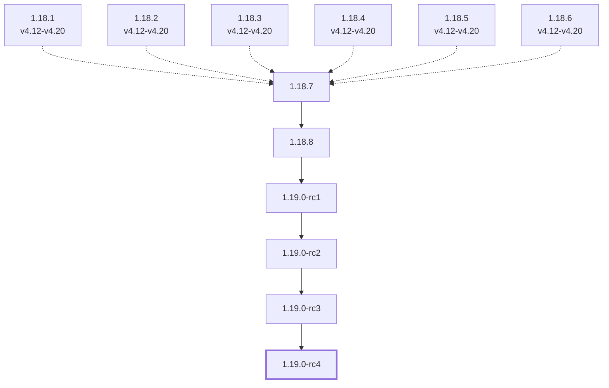
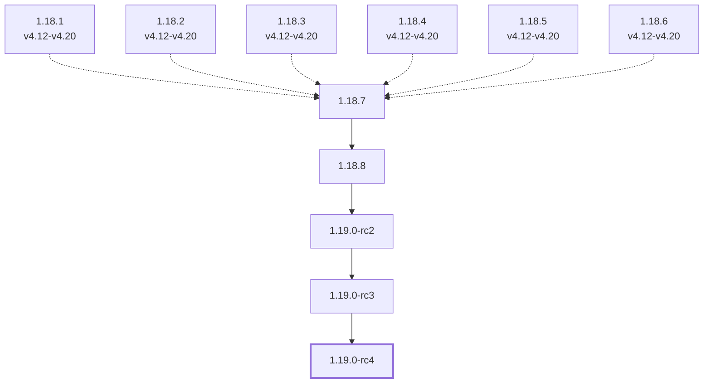
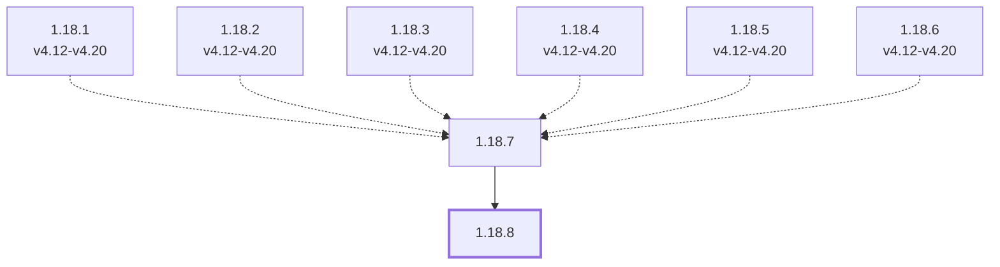

# Red Hat Marketplace versions

Update graph of each channel of operator `stackgres` in [Red Hat Marketplace](https://github.com/redhat-openshift-ecosystem/redhat-marketplace-operators),
generated by `versions-of-red-hat-marketplace.sh` from the file-based catalog templates in `operators/stackgres/catalog-templates` at commit
`7e65c49 (2026-10-05)`.

Default channel: `stable`

A solid arrow goes from a version to the one that replaces it, a dotted arrow from a
version to one that skips it. The heads of a channel have a thick border, and versions
that are only skipped, since they are no longer in the catalog, a dashed one.
A version or an arrow that is not in every OCP catalog is labeled with the catalogs it is in.

## Channel `candidate`

Head: `1.19.0-rc4`

## Channel `fast`

Head: `1.19.0-rc4`

## Channel `stable`

Head: `1.18.8`

