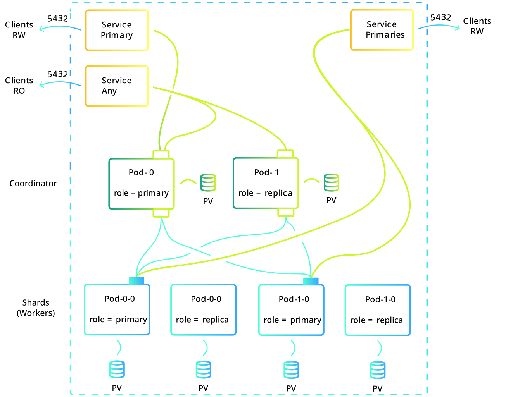

StackGres supports creating sharded PostgreSQL clusters using the SGShardedCluster custom resource. Sharding enables horizontal scaling by distributing data across multiple PostgreSQL instances.

## What is Sharding?

Sharding is a database architecture pattern that partitions data horizontally across multiple database instances (workers). Each worker contains a subset of the total data, allowing:

- **Horizontal scalability**: Add more workers to handle increased load
- **Improved performance**: Queries can be parallelized across workers
- **Larger datasets**: Store more data than a single instance can handle

## StackGres Sharding Architecture

A StackGres sharded cluster consists of:

- **Coordinator**: Routes queries to appropriate workers
- **Workers**: Individual PostgreSQL clusters holding data partitions

## Sharding Technologies

StackGres supports multiple sharding technologies:

| Technology | Description |
|------------|-------------|
| Citus | Distributed PostgreSQL extension |
| ShardingSphere | Database middleware for sharding |
| DDP (Distributed Data Platform) | Native distributed tables |

## Key Features

- **Single configuration**: Define an entire sharded cluster in one SGShardedCluster resource
- **Automatic management**: StackGres handles worker creation and coordination
- **High availability**: Each worker is a fully HA PostgreSQL cluster
- **Unified monitoring**: Monitor all workers from a single dashboard
- **Day-2 operations**: Perform operations across all workers simultaneously

## Getting Started

For detailed setup instructions, see the [Sharded Cluster Administration Guide]({}).

## Related Resources

- [SGShardedCluster Reference]({})
- [Sharded Cluster Operations]({})
