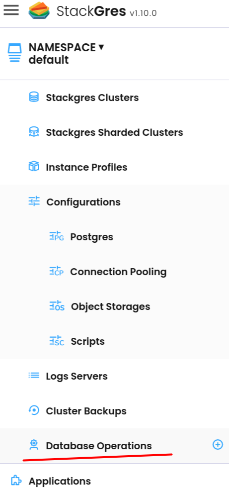
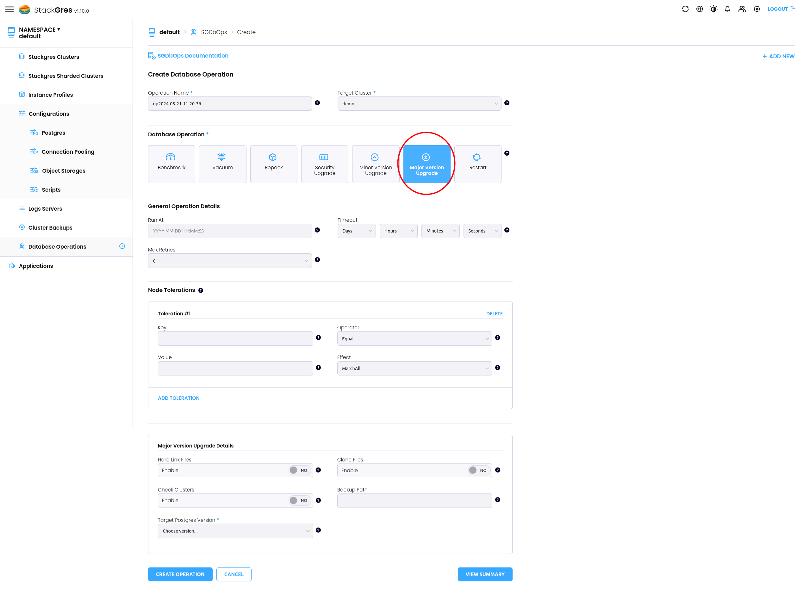
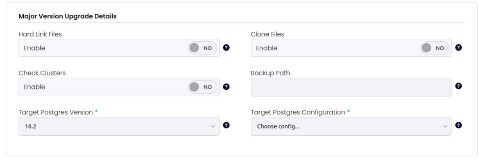

StackGres provides an easy way to perform a Postgres Major version upgrade, e.g, from `15.6` to `16.2`. It provides two different ways to perform a major version upgrade, using the Web Console or by using the Kubernetes API through the `kubectl` CLI. 

The process is meant to be straightforward, however, you need to perform some previous checks to guarantee that the process will complete successfully. 

## Preliminary Checks recommended

1. Available disk space depending if you will use hard links or not.
2. If you are using extensions, check if they are compiled for the Postgres version you're planning to migrate to. ([Extensions](https://stackgres.io/extensions/))
3. Make sure you have an up to date backup.
4. Make sure you have [SGPostgresConfig]({}) for the postgres version you're planning to migrate to.
5. Performed the upgrade in a test environment.

## Upgrade Process Flow

The major version upgrade operation follows these steps:

1. Store the status of the operation in the SGCluster status
2. Disable sync replication mode (if enabled)
3. Perform a CHECKPOINT
4. Downscale the cluster to only the primary instance
5. Change the version in the SGCluster
6. Restart (re-create) the primary Pod with the `major-version-upgrade` init container that runs the `pg_upgrade` command
7. If any container fails (configurable with `maxErrorsAfterUpgrade` field), a rollback is performed: the SGCluster is restored to its previous status and the operation terminates with an error
8. If no container fails and the Pod becomes ready, the operation is considered valid (pg_upgrade was successful and Patroni was able to start Postgres). The old data is then removed.
9. Upscale the cluster to the previous number of instances
10. Re-enable the previous sync replication mode (if different from async)
11. Remove the operation status from the SGCluster status

**Important notes:**
- Rollback is **not possible** when `link` field is set to `true`
- When `check` field is set to `true`, the data is never touched, just checked, and the cluster is brought back to its previous state after the operation completes
- If your filesystem supports it, use `clone` to greatly reduce the duration of the major version upgrade operation and allow a functional rollback in case of error by using file cloning (reflinks)


## Major version upgrade

In order to execute the process by using the `kubectl` CLI, you need to create the SGDbOps manifest. In the next example a major version upgrade from Postgres version `15.6` to `16.2` will be performed:

To execute the process create and apply the manifest with the next command:  

```yaml
apiVersion: stackgres.io/v1
kind: SGDbOps
metadata:
  name: my-major-version-upgrade
  namespace: default
spec:
  majorVersionUpgrade:
    check: false
    clone: false
    link: true
    postgresVersion: "16.2"
    sgPostgresConfig: postgres-16-config
  maxRetries: 0
  op: majorVersionUpgrade
  sgCluster: demo
```

>Note: You can check all the available options here [SGDbOps Major version upgrade]({})

You can check the process log on the process pod called `major-version-upgrade` 

```bash
kubectl logs demo-0 -c major-version-upgrade
```

At the end of the logs you should see something like:

```bash
...
+ read FILE
+ touch /var/lib/postgresql/upgrade/.upgrade-from-15.6-to-16.2.done
+ echo 'Major version upgrade performed'
Major version upgrade performed
```

## Manual rollback

By default a major version upgrade decides on its own what to do when it fails: it performs an
automatic rollback (restoring the SGCluster to its previous state) when the `major-version-upgrade`
init container fails or when the Pod does not become ready within the configured number of errors
(`maxErrorsAfterUpgrade`).

Setting `manualRollback: true` in the `majorVersionUpgrade` section lets you intervene before that
decision is made, which is useful to fix an upgrade by hand instead of losing it to a rollback:

- When the upgrade fails, the `major-version-upgrade` init container does **not** exit. It stays
  alive (sleeping) so you can exec into it, inspect the failure and, if you want to keep the upgrade,
  perform the `pg_upgrade` manually inside it.
- The operation then pauses: it sets `.status.majorVersionUpgrade.phase` to
  `wait-post-failed-upgrade-decision` (or, on a successful upgrade, `wait-post-upgrade-decision`
  before the source data directory is removed) and the operator sets the `WaitingRollback` condition
  to `True`.
- The operation waits until you set `.status.majorVersionUpgrade.rollback`:
  - `false`: the operation continues assuming the upgrade was performed manually. The init container
    exits successfully, the Pod is started and the operation waits for it to become ready tolerating
    up to `maxErrorsAfterUpgrade` plus `maxErrorsAfterContinueOnFailure` errors.
  - `true`: the operation performs a rollback regardless of whether it had failed or succeeded.

For example, to inspect a paused upgrade and then let it continue:

```bash
# Exec into the paused init container to inspect and, if needed, perform the upgrade manually
kubectl exec -it demo-0 -c major-version-upgrade -- sh

# Continue the operation (the upgrade was performed manually)
kubectl patch sgdbops my-major-version-upgrade --type merge \
  -p '{"status":{"majorVersionUpgrade":{"rollback":false}}}'

# Or roll back instead
kubectl patch sgdbops my-major-version-upgrade --type merge \
  -p '{"status":{"majorVersionUpgrade":{"rollback":true}}}'
```

## Extensions and Major Version Upgrade

When upgrading with extensions, the rule of thumb is to read the documentation of each specific extension to check if there is any special procedure to follow.

**Core and contrib extensions:** Do not require any special treatment. They are updated to the next version together with the PostgreSQL version.

**Timescaledb:** It is required to:
1. Upgrade timescaledb to the latest available version compatible with the current Postgres major version
2. Upgrade Postgres major version
3. Upgrade timescaledb to the latest version for the new Postgres major version

**Citus:** Similar requirements to timescaledb:
1. Upgrade citus extension to the latest supported version
2. Upgrade Postgres major version
3. Upgrade citus extension to the latest version

### Specifying Extension Versions

Some extensions allow specifying the target version in the SGDbOps:

```yaml
apiVersion: stackgres.io/v1
kind: SGDbOps
metadata:
  name: major-upgrade
spec:
  sgCluster: my-cluster
  op: majorVersionUpgrade
  majorVersionUpgrade:
    postgresVersion: "17.4"
    sgPostgresConfig: postgres-17
    postgresExtensions:
    - name: pg_cron
      version: "1.6"
```

> **Important:** StackGres only installs extension binaries to the specified (or latest) version. The user must execute `ALTER EXTENSION ... UPDATE TO` commands, including any custom procedure required by each particular extension.

## Steps to perform a Major version upgrade using the Web Console.

1. Go to `Database Operations` 



2. Click over the Plus (+) button 

3. Then the `Create Database Operation` page will be open.

4. Choose your target cluster

5. Select the `Major version upgrade` Operation



6. You can set the process to be executed in a specific time, if not set the process will be executed immediately.

7. If is required you can add the Node Tolerations.

8. Check the options under the `Major version upgrade details`



  - **Hard link files:** If true use hard links instead of copying files to the new cluster. This option is mutually exclusive with clone. Defaults to: false.


    >**Important:** Be aware that if you use the default, all data files will be copied to a new directory, so you need to make sure you have enough disk space to perform the operation. Otherwise, you'll run out of space.  

    The main perk of copying the files is that you can roll back to the old cluster in case of a failure. Meanwhile when using hard links, once the data directory is changed there's no roll back option. 

  - **Clone files:** If true use efficient file cloning (also known as “reflinks” on some systems) instead of copying files to the new cluster. This can result in near-instantaneous copying of the data files, giving the speed advantages of link while leaving the old cluster untouched. This option is mutually exclusive with link. Defaults to: false.

    File cloning is only supported on some operating systems and file systems. If it is selected but not supported, the pg_upgrade run will error. At present, it is supported on Linux (kernel 4.5 or later) with Btrfs and XFS (on file systems created with reflink support), and on macOS with APFS.

  - **Check Cluster:** If true does some checks to see if the cluster can perform a major version upgrade without changing any data. Defaults to: false.

  - **Backup path:** The path where the backup is stored. If not set this field is filled up by the operator.

    When provided will indicate where the backups and WAL files will be stored.

    The path should be different from the current `.spec.configurations.backups[].path` value for the target SGCluster in order to avoid mixing WAL files of two distinct major versions of postgres.

  - **Target Postgres version:** The target postgres version that must have the same major version of the target SGCluster.

  - **Target Postgres Configuration:** The postgres config ([SGPostgresConfig]({})) that must have the same major version of the target postgres version.


9. Once you select the appropriate options click on `Create Operation`
