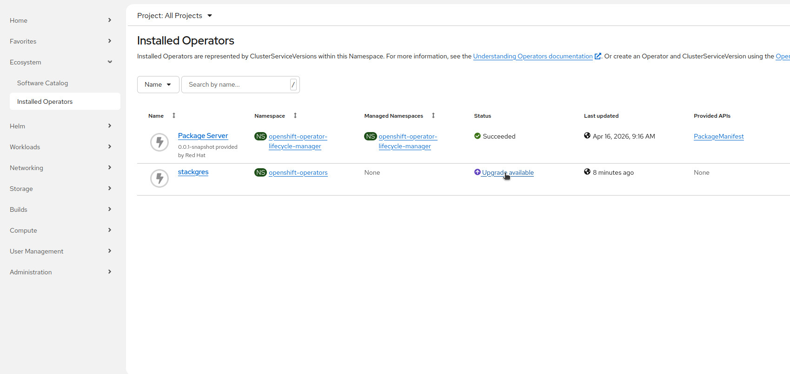
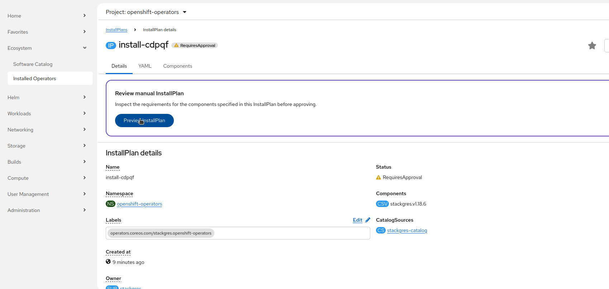
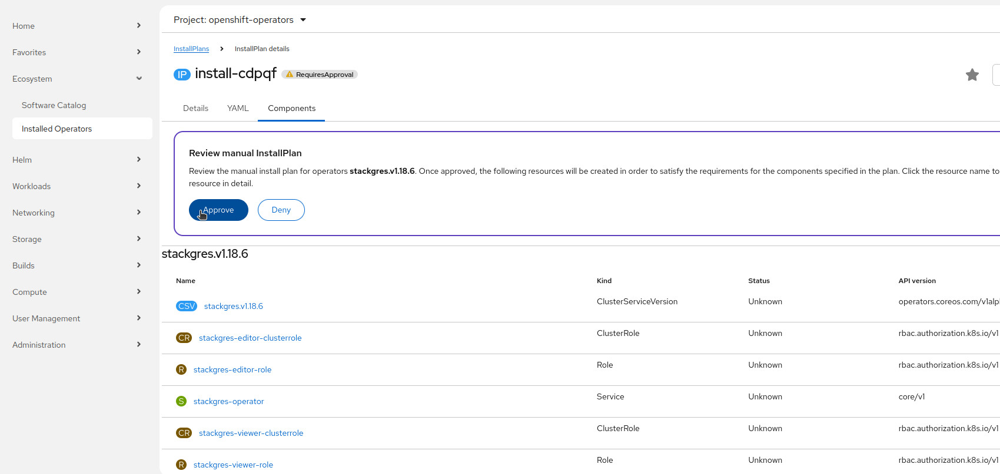

This section shows how to upgrade the StackGres operator using OperatorHub.

## Upgrading the StackGres Operator

To proceed with the installation you will have to patch the `InstallPlan` that has been created by the OLM operator:

```
kubectl get -n stackgres installplan -o name \
  | while read RESOURCE
    do
      kubectl patch -n stackgres "$RESOURCE" --type merge -p 'spec: { approved: true }'
      kubectl wait -n stackgres "$RESOURCE" --for condition=Installed
    done
```

The installation may take a few minutes.

Finally, the output will be similar to:

```plain
installplan.operators.coreos.com/install-66964 patched
installplan.operators.coreos.com/install-66964 condition met
```

Upgrading an operator serves two purposes:

* Configuration change: to enable or disable features or to change any parameter of the current installation
* Operator upgrade: to upgrade to another version of the operator

After upgrading the operator have a look at the [following steps]({}).

#### Upgrade via OpenShift Web Console

Alternatively you may install the StackGres Operator from the OpenShift Web Console by following these steps:

1. Search the StackGres Operator from the OperatorHub tab and click on the "upgrade available" link:

>     

2. Click on the "Preview InstallPlan" button

>     

3. Review the install plan and click on the "Approve" button

>     
